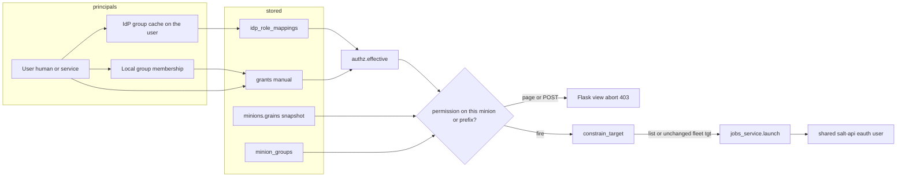

# Scoped RBAC for Overstate

| | |
|---|---|
| Author | Overstate design |
| Date | 2026-10-04 |
| Status | Draft |
| Scope | One Overstate app, one Salt fleet, many teams |
| Replaces | The global ladder in `overstate_ui/auth.py` as the only authorization model |

## Overview

Overstate authorizes every human with one string on `users.role`: `viewer` (0), then `operator` (1), then `admin` (2). `roles_required` enforces that floor on mutating routes. Every read route is bare `@login_required`, so a viewer — including an SSO user who matched no IdP group — sees the whole fleet, live pillar, the mine, file roots, the event bus, and the audit log. Minion groups are job targets, not boundaries. salt-api is one shared eauth user.

That is the right model for a single ops team. It cannot express an enterprise fleet: an app team that may act only on its minions, a platform team whose agents sit on every host, a security team that can read but not execute, an auditor who must not open pillar, or a CI identity that may fire one saved job. A fleet-wide viewer is also the wrong default for a new SSO account, because pillar and mine are secret-bearing.

This design adds **scoped RBAC grants** evaluated in-process. A grant is a built-in role bound to a principal and one scope. Roles expand to a closed permission catalog mapped onto the routes and Salt function classes that exist today. Scopes union. There is no deny row in v1. A job target, a mine read, and a kill are resolved against `minions` and `minion_groups` and intersected with the caller's scope **before** publish; a non-fleet caller never sends `tgt=*` to salt-api. Checks do not call salt-api. `users.role` and `roles_required` keep working while `rbac_mode` is legacy. The setting `rbac_mode=scoped` is inert until the same change that filters reads and constrains every publish path sets `ENFORCEMENT_COMPLETE`. Rollback is `rbac_mode=legacy`.

Kubernetes RBAC for the app ServiceAccount (`deploy/kubernetes/rbac.yaml`) is a different system and is not changed.

## Background & Motivation

### Current authorization

`overstate_ui/auth.py` defines the ladder and the only gate:

```46:67:overstate_ui/auth.py
LEVELS = {"viewer": 0, "operator": 1, "admin": 2}

def role_level(role: str | None) -> int:
    return LEVELS.get(role or "", 0)

def roles_required(*roles: str):
    """Require one of ``roles``; higher levels imply lower ones."""
    minimum = min(LEVELS[r] for r in roles)
    # ... login_required, then abort(403) when role_level(current_user.role) < minimum
```

`User.role` is a single `String(16)` column (`overstate_ui/models.py`). `seed_admin` inserts an `admin` only when `users` is empty. Local passwords are argon2. Login is rate-limited (`RATE_LIMIT = 10`, `RATE_WINDOW = 60`) in Redis with a process-memory fallback.

OIDC (`provision_oidc_user`, `role_for_groups`) JIT-creates a user keyed on `(oidc_issuer, oidc_sub)` and never merges into a local account. Each login overwrites `user.role` from the groups claim (`oidc_groups_claim`, default `groups`): intersection with `oidc_admin_groups`, else `oidc_operator_groups`, else `viewer`. Manual edits on the Users page do not survive the next login. `docs/developer.md` states that this overwrite is intentional: one column must not be split-brained. `docs/admin.md` and `docs/sso.md` document the same rule.

`MinionGroup` (`minion_groups`) is a named JSON member list. Operators CRUD it (`overstate_ui/groups.py`). Job target types are `glob`, `list`, `grain`, `compound`, `nodegroup`, and `group` (`jobs_helpers.TGT_TYPES`). `resolve_group_target` and `resolve_batch_roster` already pin list, glob, and group targets to the `minions` snapshot locally. Grain, compound, and nodegroup return `None` from `resolve_batch_roster` and are forwarded to Salt unchanged. `settings.default_target` defaults to `*`. `suggest_glob` returns `*` when the selection covers the roster it was given (`jobs_helpers.py`).

`launch()` (`jobs_service.py`) publishes that target as given. `run_wave_batch` and `run_orchestrate_task` (`tasks_batch.py`) run later in the RQ worker, or inline when no worker is up, with a username string and **no second authorization check**. Salt schedules and reactors run later inside Salt, not in the worker: once `schedule.add` or `reactor.add` succeeds, Overstate is out of the loop.

Pillar (`pillar.items`, `pillar_snapshots`), mine (`mine.get`), file roots, and `audit_events` are readable by any logged-in user. Minion detail loads live pillar on the pillar tab and again on the raw tab (`minions.py` `detail`). Inventory refresh calls `grains.item` on `*` (`inventory.refresh_inventory`). The snapshot stores only `SNAPSHOT_GRAINS` (os, osfinger, osrelease, fqdn, ipv4, cpuarch, num_cpus, mem_total, virtual, saltversion, proxytype, proxyid), not the full grain set.

The execution allowlist is `ALLOWED_FUNS` in `jobs_helpers.py`. `cmd.*`, `file.*`, and `system.*` are rejected before Salt. Destructive and state functions sit in `CONFIRM_FUNS` and stay type-to-confirm unless `state.apply` / `state.highstate` is `test=True`. The console (`console.py`) uses the same allowlist, plus `salt-key` and a small `RUNNER_ALLOW` (`jobs.list_jobs`, `jobs.lookup_jid`, `jobs.active`, `manage.status`, `manage.versions`).

salt-api auth is one pam user, `overstate`, granted `@wheel`, `@runner`, and `@jobs` (`salt-config/api.conf`). Every Overstate process shares that identity. Hiding a button is not the boundary; templates still branch on `current_user.role` only to decide what to render (`base.html`, `users.html`, and the page templates). The server rejects forged mutations with 403. Users cannot demote or delete themselves (`users.py` `set_role`, `delete`). Mutations call `audit.log_event`. `audit_events.action` is `String(64)`; at least one caller already truncates (`minions.remove` slices the partial key-delete action to 64).

### Pain

An enterprise IdP already has the teams. Overstate can see those group names only as a single global role, and the unmatched default is a fleet-wide secret reader. Overlapping responsibility (platform agent on every host, app team on a subset, security read-only) cannot be written down. Separation of duties collapses to three rungs: inventory, pillar, `test.ping`, `pkg.install`, `state.apply`, key accept, file-root edits, schedules, reactors, master config, and user admin are not distinct. CI uses a shared human operator. A team lead cannot manage membership inside a slice without becoming a global admin.

### Scale this design is for

| Quantity | Design point | Check implication |
|---|---|---|
| Minions | low thousands (size at 3,000) | One indexed id query or one JSON key predicate. Not a salt-api round trip. |
| Human users | low hundreds (size at 400) | Grants loaded per request, not cached in Redis. |
| Teams | dozens (size at 40 IdP groups, 30 local groups) | |
| Grants | low thousands (size at 5,000; expect ~1,000) | Single-digit-millisecond PK/IN lookup. Table plus indexes is a few MB. |
| Page-render authz budget | ≤ 30 ms p99, excluding Salt, template render, and password hashing | One grant query + at most one `SELECT id, grains FROM minions`, memoized on `flask.g`. |
| Job-submit authz budget | ≤ 50 ms p99 before publish | Same work, then build a list target. Publish, salt-api, and argon2 token verify are outside this budget. |

A 3,000-id snapshot load is about 1–2 MB of the small `SNAPSHOT_GRAINS` documents (not full `grains.items`) and stays inside that budget in process. Grain matching is Python on that list, not a Postgres `->>` predicate: `->>` is not valid SQLite, and the test suite plus the tripwire run on SQLite (`docs/developer.md`). A comma-separated list target of a few thousand ids is a ~50–100 KB salt-api body, acceptable at this size and not a design point beyond it. Glob matching 3,000 ids in Python (`fnmatch.fnmatchcase`, the same function `resolve_batch_roster` uses) is under a millisecond.

## Goals & Non-Goals

### Goals

- One concrete model an engineer can implement in this Flask app without a new service, framework, or database.
- A closed permission catalog covering today's routes and the duty splits below.
- Built-in roles that reproduce global viewer, operator, and admin, plus enterprise roles for scoped teams, secrets, schedules, security read, audit, key custody, and delegated admin.
- Scopes a grant can bind to a minion slice (saved minion group, id list, glob, snapshot grain) or to a non-minion resource (file-root prefix, and fleet-only resources).
- Overlapping grants union. Default deny for a principal with no grant. No explicit denies in v1.
- IdP group membership grants scoped roles. Local users and local groups get grants an admin can edit.
- Job, batch, console, kill, mine, highstate preview, and inventory-refresh targets are intersected locally before any Salt publish. `*` cannot escape a non-fleet scope. Salt-ssh stays fleet-only.
- Say, for schedules, reactors, batches, and orchestrate, whether the grant is checked when the automation is defined, when it fires, or both.
- `users.role` keeps authorizing existing installs while `rbac_mode=legacy`. Feature flag and rollback.
- Server-side enforcement. UI hiding stays cosmetic. Type-to-confirm, self-demote, self-delete, login rate limit, issuer+sub identity key, and mutation audit stay.
- Audit of grant changes and of denied attempts, with a defined split between a fleet auditor and a scoped team.
- Tests that keep `tests/test_rbac.py` and `tests/test_role_gates.py` green on the legacy path, and a new matrix for scoped allow, `*` not escaping, pillar hidden, IdP mapping, and forged POST 403.

### Non-goals

- Organizations, tenants, or a second database. One Overstate, one fleet.
- A policy language, a policy IDE, custom roles in v1, explicit denies in v1, nested local groups.
- Redesigning `deploy/kubernetes/rbac.yaml` (app ServiceAccount: named ConfigMaps, salt-master StatefulSet patch, pod read). Mentioned only so it is not confused with user RBAC.
- Per-user Salt `external_auth` ACLs, OPA, Cedar, or a Zanzibar service. Compared below and rejected as the primary model.
- Adding `cmd.run` or widening `ALLOWED_FUNS`. Arbitrary shell is not an Overstate capability today and v1 does not create one.
- Evaluating Salt compound or nodegroup matchers locally. Both can see pillar or master config that is not in Postgres.
- Intercepting a schedule or reactor at the moment Salt fires it. That execution does not pass through Overstate.
- Replacing the shared salt-api eauth user. Defense in depth there is follow-on work, not this design.
- A general REST API. v1 adds one bearer endpoint for CI to fire a job.

## Proposed Design

### Architecture



Authorization is a pure function over rows already in Postgres plus the request's principal. `flask.g` holds the effective permission map for the request so a page that renders 50 rows does not re-query. Redis is not on the authz path: a 30 s cache would delay revocation, and the existing roster cache (`cached_roster`, `ROSTER_TTL`) includes minions the caller must not see. Filter that data after the cache read; do not authorize from it.

`launch` is not the only publish. Mine reads, `jobs.kill`, highstate preview, inventory refresh, batch waves, orchestrate, beacons, keys, reactor runners, and `fileserver.update` each call `constrain_target` or the kill / ssh rule before their own Salt call. See Later execution. A diagram arrow into `launch` does not cover those sites.

### 1. Principals

Four kinds. Service accounts are users, not a parallel identity system.

| Kind | Stored as | How it authenticates | How it receives access |
|---|---|---|---|
| Human, local | `users` row, `password_hash` set, `oidc_sub` null, `kind=human` | Existing login form | Manual grants and local-group membership |
| Human, SSO | `users` row, `password_hash` null, `(oidc_issuer, oidc_sub)` unique | Existing OIDC code flow | IdP mappings via the groups claim, plus optional manual grants |
| Local group | `local_groups` + `local_group_members` | Never authenticates | Grants on the group apply to members |
| Service account | `users` row, `kind=service`, both password and OIDC null | Bearer token in `api_tokens` only | Manual grants. Optional pin to one saved job |

IdP groups are **not** copied into `local_groups`. Membership authority stays at the IdP. The app stores the last seen claim in `user_idp_groups`, replaced wholesale on each successful `provision_oidc_user`. That is the same timing as today's role overwrite: removal from an IdP group takes effect at the next login, not at the IdP's click. Deleting or editing an `idp_role_mappings` row takes effect on the next request, because evaluation reads the mapping table, not a copied grant.

Local groups exist in v1 because local accounts have no IdP group, and a team lead needs a membership list they can edit. Nesting is out of scope. A user may be in many local groups. Effective grants are the union of user grants, local-group grants, and IdP mappings for cached group names.

Service accounts cannot use `/login`. `login()` already rejects `password_hash is None`. The bearer path is the only one that loads them (`API / Interface Changes`).

The existing self-guards stay, and gain one analogue: a user cannot delete their own last fleet grant of role `admin`, and cannot delete their own user row. `seed_admin` still creates the first admin when `users` is empty, and also inserts that user's fleet `admin` grant so the flag can be turned on without locking the installer out.

### 2. Permissions

Permissions are string constants in a new module `overstate_ui/authz.py`. They are not rows. No role editor can invent one in v1. Each permission has a **domain** that says which scopes can carry it:

- `minion` — checked against a minion id, or against "any minion" when the route has no id (nav, index).
- `prefix` — checked against a relative file-root path.
- `fleet` — honored only when the grant's scope kind is `fleet`. A team-sized scope never carries these, even if the role definition lists them.
- `delegate` — `user.read` and `audit.read` only. Honored on a minion scope as the filtered view defined below, and on a fleet scope as the unfiltered view. They are not dropped on a team-lead grant. They are not `user.admin`.

`job.run.arbitrary` is reserved and granted by nothing. `ALLOWED_FUNS` stays the execution ceiling.

#### Function classes

Mapped from `ALLOWED_FUNS`, `CONFIRM_FUNS`, and `DESTRUCTIVE_FUNS`. The class is what a route checks; the allowlist is still checked first, exactly as `jobs.run` does today.

| Class | Permission | Functions |
|---|---|---|
| Read | `job.run.read` | `test.ping`, `service.status`, `schedule.list`, `beacons.list`, `sys.doc`, `sys.list_functions`. Not `state.show_sls`, not `grains.items`, not `state.show_highstate`. `beacons.list` is published only after `launch` forces `include_pillar: False` and `include_opts: False` on `kwarg` (below) |
| Change | `job.run.change` | `pkg.install`, `pkg.remove`, `service.restart`, `ps.kill_pid`, `mine.update`, `saltutil.sync_all`, `saltutil.refresh_pillar` |
| State | `job.run.state` | `state.apply`, `state.highstate`, `state.show_sls`, including `test=True` on apply and highstate. Executing `state.show_sls` and reading its return are the same permission |
| Orchestrate | `job.run.orchestrate` | `state.orchestrate` (runner, fleet domain) |
| Schedule define | `schedule.write` on that minion, plus a schedule-class allow (below) | `schedule.add`, `schedule.enable_job`, `schedule.disable_job`, `schedule.delete` |
| Schedule class allow | `schedule.allow.read`, `schedule.allow.change`, `schedule.allow.state` | Not consulted by `jobs.run` or `console._cmd_salt`. Consulted only by `schedules.add` and by a job-form or API `schedule.add` whose `function=` argument is in that class |
| Beacon write | `beacon.write` | `beacons.enable_beacon`, `beacons.disable_beacon` |
| Mine read | `mine.read` | `mine.get`, including `mine.index` |
| Pillar document | `pillar.read` | `pillar.items`, `grains.items` (full live grains), `state.show_highstate` |
| Kill | `job.kill` | `saltutil.kill_job` |

`test=True` skips the confirm modal today (`is_test_mode`) and must **not** skip `job.run.state`. `state.show_highstate` is not read-class. The job form, the console, and `minions.states_refresh` (`show_highstate_now` / `show_highstate_task`) all require `pillar.read` on the target minion. `team-operator` does not have `pillar.read` and is 403 with no Salt call.

`grains.items` is the full live grain set. Snapshot columns already on `minions.grains` stay `minion.read`. The overview and raw tabs may render the snapshot for `minion.read`. They call `grains.items` only when the caller has `pillar.read` on that id. Authz itself still does not read live grains; the page must not either.

Running state and reading pillar documents are different permissions. Return visibility, applied from `job.fun` before render. The renderers are job detail, `jobs.panel`, `jobs.stream`, the minion jobs tab, the live `jobs.lookup_jid` merge, and console `_cmd_salt` when `--sync` builds lines (below). A string payload is not an exception:

| Payload `job.fun` | Full body requires | Who sees metadata only (jid, fun, success, minion id) |
|---|---|---|
| `state.apply`, `state.highstate`, `state.show_sls` | `job.run.state` on that minion. Comments and changes included. This is the `team-state` duty | `job.read` without `job.run.state`: `team-viewer`, `team-operator`, `auditor` |
| `state.show_highstate`, `pillar.items`, `grains.items`, `beacons.list` | `pillar.read` on that minion. This includes a stored `grains.items` return and a `beacons.list` return, filtered or not. `describe_return` classifies both as `kind=unknown` and must not be the gate | everyone else with `job.read`, including `team-viewer` and `team-operator`: metadata only |
| `state.orchestrate` | fleet `pillar.read` (the stored runner return is one document, not a minion slice) | `auditor`, `security-reader`, anyone with `job.read` and without fleet `pillar.read` |
| `mine.get` | `mine.read` on that minion | everyone else with `job.read` |
| anything else | `job.read` on that minion. Not a fallback for the rows above. `beacons.list` and `grains.items` are never this row | — |

`describe_return` in `jobs_helpers.py` classifies by payload shape and does not receive the function name. `pillar.items` and `mine.get` are ordinary dicts and fall through as `kind=unknown`, which the panel renders as raw JSON. Do not hide secrets inside `describe_return`. The view passes an already-redacted payload, or skips the raw branch, based on `job.fun`.

Stored `PillarSnapshot` rows and `pillar.diff` require `pillar.read` on **both** ids, including `rev=live`. Missing either id is 403 and does not call Salt. The pillar tab and the pillar half of the raw tab are the same rule.

Confirm-time preview (`build_sls_preview` in `jobs_service.py`, which calls `state.show_sls`) runs only when the caller has `pillar.read` on every id in the intersection. Otherwise the confirm page says the render is hidden and does not call Salt. Type-to-confirm still applies. A `team-state` user without `pillar.read` can fire `state.apply` and can read that job's return, and cannot see the confirm-time render.

`_states_stored` (`minions.py`) returns `states` (comments included) and `raw`. On the states tab, apply the table above from the stored `fun` before render. Drop `raw` unless the body rule passes. The conformity page (`state.read`) shows status strings on `minions.conformity` only, never return bodies.

`schedule.add` on the job form and `schedules.add` both call `may_define_schedule(user, mid, fun)`: `schedule.write` on that minion, `fun` in `ALLOWED_FUNS`, and either `job.run.<class>` on that minion or the matching `schedule.allow.*` permission. `schedule.allow.*` does not satisfy `jobs.run` or the console. A `scheduler` can add a `state.apply` schedule and cannot POST `/jobs/run` for `state.apply`. Revoking the user does not delete the minion schedule; that limit is unchanged.

Beacon list on the minion tab: the first `beacons.list` call can include pillar-sourced config. `beacon.read` may render only the second call, the one with `include_pillar: False` (`minions.detail`). If that call fails, show the names without pillar values, not the first payload. Pillar-sourced beacon config requires `pillar.read`. That tab rule is unchanged.

`jobs.run`, console `salt`, and `POST /api/jobs/run` (including a pinned saved job whose function is `beacons.list`) may still run `beacons.list` under `job.run.read`. Do not reject the function. Do not "overwrite a dict" at those three views and stop there. Today that dict never leaves the process.

`SaltClient.local` (`overstate_ui/salt_client.py`) copies `kwarg` onto the salt-api payload only when the caller passes it (`if kwarg: payload["kwarg"] = kwarg`), for `local`, `local_async`, and `ssh`. `launch` and `_publish_all_async` (`overstate_ui/jobs_service.py`) call `client.local` with `arg=args` and no `kwarg`. The ssh branch inside `launch` is the same. Both functions grow `kwarg: dict | None = None` and pass it on every `client.local`, including ssh. `run_wave_batch` (`tasks_batch.py`) also publishes `arg=args` with no `kwarg`; it takes the same argument and the same forced dict, or a batch of `beacons.list` skips the rule.

`jobs.run` splits the args box on whitespace into a list of strings (`include_pillar=True` is one token). Console `_cmd_salt` puts leftover tokens in that same list: `salt web-01 beacons.list include_pillar=True` becomes `args=["include_pillar=True"]`, and that list is what `launch` publishes today. The API body may send the same token in `args` or a JSON object in `kwarg`. `launch` is the single place that fixes all three, before the ssh branch and before `_publish_all_async`:

- When `fun` is `beacons.list`, drop positional tokens whose name is `include_pillar` or `include_opts` (`include_pillar=True`, `include_opts=false`, any value). Drop those keys from a dict element in `args` and from the `kwarg` dict.
- Then set `kwarg["include_pillar"] = False` and `kwarg["include_opts"] = False`. The dict is non-empty, so `SaltClient.local`'s `if kwarg:` does not drop it.
- Other functions pass `args` and `kwarg` through unchanged.

A client `True` left in `args` is not on the wire. The return-visibility row still applies: the full body requires `pillar.read` on that minion, whether or not the kwargs were forced. A stored return whose recorded args do not have both flags false (a historical job, or a publish path that forgot) is the same row, not `job.read`. `grains.items` stays out of `job.run.read` and out of `API_READ_FUNS`. A stored `grains.items` body is `pillar.read`, not "anything else." `team-viewer` sees metadata only for that return.

Console `--sync` is a different renderer from the job page. Default `asynchronous` is true, so a normal fire only prints the jid. `--sync` sets `asynchronous` false, `launch` waits, and `_cmd_salt` reads `JobReturn`. When `payload` is not a dict it appends `str(payload)[:160]`. Salt's default `beacons.list` is a YAML string (the minion tab passes `return_yaml: False` for that reason), so that branch prints beacon config. Apply the return-visibility table inside `_cmd_salt` before building those lines. A caller without the body permission on that minion gets `{minion_id}: ok` or `{minion_id}: FAIL` only. Do not append the payload, including when it is a string. The echoed `$ salt ...` line may still show what was typed. The lines after it must not contain the return body. The job-page link does not replace this check.

Test `test_beacon_and_grains_returns`: a `team-operator` POST `/jobs/run` and an unpinned token publish `kwarg` with both flags false and do not return pillar-sourced keys. Console argv `salt <id> beacons.list include_pillar=True` makes the Salt mock see `kwarg` false and an `arg` list that does not contain that token. `--sync` output for that `team-operator` does not contain the return body. A `team-viewer` opening a stored `grains.items` return gets metadata only.

#### Catalog and the call sites it replaces

Domain is `minion` unless noted. "Floor" is the current gate.

| Permission | Domain | Floor today | Call sites |
|---|---|---|---|
| `minion.read` | minion | login | `minions.index`, `search`, `presence`, `export_csv`, detail overview **snapshot** grains and jobs-tab metadata; dashboard counts filtered to scope; `groups` roster picker filtered to scope. Not live `grains.items` |
| `minion.refresh` | minion | operator | `minions.refresh`, `minions.refresh_one`. Fleet `*` refresh only with a fleet grant; otherwise `grains.item` on the allowed id list |
| `minion.remove` | minion | operator | `minions.remove` without key delete |
| `minion.onboard` | fleet | login | `minions.onboard`, `minions.onboard_script`. The script embeds `master_host` |
| `pillar.read` | minion | login | `pillar.index`, `pillar.detail`, `pillar.diff` (both ids, `rev=live` and snapshot rows); pillar tab and the pillar half of the raw tab; live `grains.items` on overview and raw; `state.show_highstate` on the job form, the console, and `minions.states_refresh`; confirm-time `build_sls_preview`; `state.show_highstate` and `state.orchestrate` return bodies |
| `pillar.capture` | minion | operator | `pillar.capture` |
| `mine.read` | minion | login | `mine.index` (after `constrain_target`, see below); minion detail mine tab; job-form `mine.get`; `mine.get` return bodies |
| `job.read` | minion | login | `jobs.index`, `jobs.detail`, `jobs.panel`, `jobs.stream`, `jobs.fun_doc`; minion detail jobs tab. Metadata always. Full bodies follow the return-visibility table, not this row alone |
| `job.run.read` | minion | operator | `jobs.run`, `console._cmd_salt` when the function is read-class |
| `job.run.change` | minion | operator | same, change-class |
| `job.run.state` | minion | operator | same, state-class, including dry-run |
| `job.run.orchestrate` | fleet | operator | `jobs.orchestrate` (GET and POST). The runner can target anything inside the SLS; a minion scope cannot contain it |
| `job.kill` | minion | operator | `jobs.kill`, which calls `client.local` and does **not** go through `launch`. List, glob, and group stored targets must resolve entirely inside scope. A stored `compound`, `nodegroup`, or `grain` target is 403 unless the caller has fleet `job.kill`. Do not kill a subset of someone else's compound |
| `job.save` | minion | operator | creating a `SavedJob` from `jobs.run`; `jobs.delete_saved`. Resolved target must sit inside scope |
| `job.batch` | minion | operator | `jobs.run` when batch fields are set; `jobs.cancel_batch`. Cancel only if the caller is the job user and still holds `job.batch` on the remaining pinned ids, or holds it on fleet |
| `job.sync` | minion | operator on POST, but GET `jobs.detail` and `jobs.index` already call `sync_job` | `jobs.sync`. Treated as `job.read` so the POST matches the GET. Not a publish |
| `key.read` | minion for accepted ids that are in the snapshot; fleet to see pending, rejected, denied, and unmatched ids | login | `keys.index`. Scoped callers see accepted ids in scope only. The pending pile is fleet `key.read` |
| `key.accept` | fleet | operator | `keys.act` accept and reject, `keys.reconcile`, console `salt-key -a/-r`. A pending key has no trustworthy grain |
| `key.delete` | minion | operator | `keys.act` delete, `minions.remove` when `delete_key=yes`, console `salt-key -d`. The id must be in scope. Wildcards stay rejected (`keys.act` already refuses `*?[]`) |
| `schedule.read` | minion | login | `schedules.index`; minion detail schedule tab |
| `schedule.write` | minion | operator | `schedules.add`, `schedules.act`; job-form `schedule.*`. Define-time only, together with `schedule.allow.*` or `job.run.*` as in `may_define_schedule`. Does not by itself allow `jobs.run` |
| `schedule.allow.read` / `.change` / `.state` | minion | none (operator uses `job.run.*` instead) | `schedules.add` and the `function=` of `schedule.add` only |
| `beacon.read` | minion | login | minion detail beacons tab, `include_pillar: False` payload only. A `beacons.list` **job** return is not this permission; that body is `pillar.read` |
| `beacon.write` | minion | operator | `minions.beacon_act` |
| `state.read` | minion | login | `states.index`, filtered to in-scope minions. Watched-SLS names are global and not secret |
| `state.watch` | fleet | operator | `states.watch`, `states.unwatch`, `states.recompute`. The watch list and recompute are fleet-wide writes; a slice must not change them |
| `group.read` | minion | login | `groups.index`. See groups whose members are a subset of scope, plus groups named by the caller's own grants |
| `group.write` | minion | operator | `groups.create_group`, `rename_group`, `edit_group_members`, `edit_group`, `delete_group`. New members must sit in scope. A group whose id is `scope_value` on any `grants` row or any `idp_role_mappings` row with `scope_kind=group` is frozen for anyone but fleet `grant.admin` (members, rename, and delete) |
| `file.read` | prefix | login | `files.index`, `files.view` |
| `file.write` | prefix | operator | `files.edit`, `files.save` |
| `file.sync` | fleet | operator | `files.sync`, `files.fetch`, `files.sync_modules`. `fileserver.update` and runner `saltutil.sync_all` are not prefix-aware |
| `file.git` | fleet | admin | `files.push`, `files.repo`, `files.repo_clone`, `files.repo_set_remote`, `files.repo_reset`, `files.repo_reclone`, `files.repo_token_save`, `files.repo_token_clear` |
| `reactor.read` | fleet | login | `reactor.index`, `reactor.view`, `reactor.export` |
| `reactor.write` | fleet | operator | `reactor.add`, `reactor.delete`, `reactor.add` wizard `add/step2`, `add/review`. An SLS can target `*` |
| `reactor.persist` | fleet | admin, and the inline `current_user.role == "admin"` check in `reactor.add` (line 532) | `reactor.edit`, `reactor.save`, and persist-to-disk on add. In scoped mode that inline check is `authorize(..., "reactor.persist")`, not the role string |
| `event.read` | fleet | login | `events.index`, `events.stream`. Event bodies are not a stable minion id. v1 does not filter them; scoped roles simply do not include this permission |
| `audit.read` | minion or fleet | login | `audit.index`. Fleet sees every row. A minion scope sees rows tagged with an in-scope minion, plus the caller's own rows |
| `console.runner` | fleet | operator | `console._cmd_runner`. `jobs.list_jobs` and `manage.status` are fleet-wide. `salt` subcommand uses the job-run class. `salt-key -L` is fleet `key.read`, not `job.run.*`. `salt-key -a/-r` is `key.accept`. `salt-key -d` is `key.delete` |
| `dashboard.probe` | fleet | operator | `dashboard.check_now`, and the only principal who may see eauth capability results. Probes the shared eauth user's wheel/runner rights and pings `ping_target()` (the first snapshot id). Not a team action. `GET /` must not enqueue `capabilities_task` or `master_status_task` without this permission |
| `master.read` | fleet | admin | `masterconfig.index`, `masterconfig.view`. `legacy_redirect` stays login-only; it only redirects |
| `master.write` | fleet | admin | `masterconfig.edit`, `save`, `revert`, `checklist_refresh` |
| `master.rollout` | fleet | admin | `masterconfig.restart` |
| `settings.read` | fleet | login | `settings.index` GET for non-secret display only: `page_size`, `theme`, `master_host`. Not OIDC issuer, client id, group lists, or the client secret. Not the rotation card |
| `settings.write` | fleet | admin | `settings.save` |
| `settings.rotate_eauth` | fleet | admin | `settings.rotation_generate`, `settings.rotation_verify`, `users.rotation`, `users.rotation_regenerate`, `users.rotation_verify` |
| `user.read` | delegate | admin | `users.index`. Fleet scope: full directory. Minion scope: the filtered delegate view only (users and local groups that hold a grant intersecting the scope, and only those grant rows). Never `user.admin` |
| `user.admin` | fleet | admin | `users.set_role`, `users.delete`, service-account and token management |
| `grant.admin` | fleet | admin (no separate surface today) | create, update, delete any grant; edit `idp_role_mappings`; unfreeze minion groups; see OIDC fields on Settings (`_settings_context` and `templates/settings.html` must not use `role == "admin"` for that in scoped mode) |
| `grant.delegate` | minion | none | team-lead grants inside a subset of their scope. Cannot write IdP mappings, fleet scopes, or fleet-domain permissions |

`auth.logout` stays `@login_required` for every authenticated principal, including one with zero grants. Login and the OIDC routes stay anonymous. `GET /` stays 200 for a zero-grant user and renders an empty state from Postgres, not a 403, so they are not stuck after SSO. That render must not enqueue `fleet_keys_task`, `fleet_presence_task`, `fleet_versions_task`, `master_status_task`, or `capabilities_task` (`dashboard.index` enqueues all five today). `GET /dashboard/panels` is 403 for a zero-grant user. A caller with only minion-scoped `minion.read` also does not enqueue those fleet probes; counts come from `minions` rows inside the scope. Fleet `key.read` is what may enqueue `fleet_keys_task`. `dashboard.probe` is what may enqueue `capabilities_task` and `master_status_task`. Fleet `minion.read` is what may enqueue presence and version probes.

`jobs.new` calls `fun_index_task` / `list_functions_now` on `ping_target()` (first snapshot id) for every login today. In scoped mode, run that only when the chosen reader is inside the caller's `job.run.read` or `job.read` scope. Do not pass an out-of-scope `ping_target()`.

`jobs.detail` merges `live_returns_now` (`jobs.lookup_jid`) into the template. Filter that live list with the same minion set as stored `JobReturn` rows. `jobs.index` syncs the ten newest running jobs; sync and render only jobs whose published ids intersect `job.read`. The rendered `job.tgt` is the published ids the caller may see, never an out-of-scope id from a comma list. Fleet `job.read` sees the stored target. `tgt_requested` is shown only to a caller who could see every id that string would name.

While `rbac_mode()` is legacy, none of these permissions are consulted. `roles_required` and bare `login_required` behave exactly as they do now. `rbac_mode()` stays legacy until `ENFORCEMENT_COMPLETE` is true, even if the setting row says `scoped`. See Enforcement.

### 3. Roles

v1 ships **built-in roles only**. A grant stores a role name. `authz.ROLE_PERMS` expands it. Custom roles would be a second product (a multi-select of the catalog) and are deferred; the catalog is already a dict so a later table can store the same strings without an evaluator rewrite.

Higher-implies-lower is **role composition**, not `role_level`. `operator` includes every `viewer` permission. `admin` includes every `operator` permission plus the admin delta. Enterprise roles are not rungs on that ladder. A principal's power is the union of every grant.

Fleet-only roles may be stored only with `scope_kind=fleet`. The writer rejects anything else with 403. The evaluator ignores a fleet-only role whose scope is not fleet, so a direct database insert cannot turn `admin` into `master.write`. Fleet-only roles are `viewer`, `operator`, `admin`, `security-reader`, `auditor`, and `key-custodian`.

`team-viewer`, `team-operator`, `team-state`, `secrets-reader`, `scheduler`, `file-reader`, `file-editor`, and `team-lead` may be stored on a minion matcher, a prefix where the role has prefix permissions, **or** `scope_kind=fleet`. A platform team may hold fleet `team-operator`. The fleet-only rejection helper must not reject these roles. Fleet-domain permissions inside them still require the grant's scope to be fleet: a minion-scoped `team-lead` does not gain `key.accept` or `settings.write`. `user.read` and `audit.read` on that minion scope are the delegate exception, not a drop.

| Role | Scope it may be granted on | Permissions |
|---|---|---|
| `viewer` | fleet only | `minion.read`, `minion.onboard`, `pillar.read`, `mine.read`, `job.read`, `job.run.state` is **not** included, `state.read`, `schedule.read`, `beacon.read`, `group.read`, `file.read` (whole tree), `reactor.read`, `event.read`, `audit.read`, `key.read` (fleet), `settings.read` (display only), dashboard counts. No execute, no probe. This compatibility bundle **does** include pillar, mine, the event bus, and whole-tree files, because that is what `@login_required` does today. It is the exception to "secrets are separate," not the pattern for new roles |
| `operator` | fleet only | viewer, plus `minion.refresh`, `minion.remove`, `pillar.capture`, `job.run.read`, `job.run.change`, `job.run.state`, `job.run.orchestrate`, `job.kill`, `job.save`, `job.batch`, `key.accept`, `key.delete`, `schedule.write`, `beacon.write`, `group.write`, `file.write`, `file.sync`, `reactor.write`, `state.watch`, `console.runner`, `dashboard.probe` |
| `admin` | fleet only | operator, plus `file.git`, `reactor.persist`, `master.read`, `master.write`, `master.rollout`, `settings.write`, `settings.rotate_eauth`, `user.read` (full directory), `user.admin`, `grant.admin` |
| `team-viewer` | minion matcher or fleet | `minion.read`, `job.read`, `state.read`, `schedule.read`, `beacon.read` (no pillar beacon config), `group.read`, `key.read` (accepted ids in scope only), dashboard counts filtered to scope. No pillar, mine, files, events, audit, settings, execute. State-apply bodies are metadata only |
| `team-operator` | minion matcher or fleet | team-viewer, plus `minion.refresh`, `job.run.read`, `job.run.change`, `job.kill`, `job.save`, `job.batch`. No `job.run.state`, no pillar, no keys accept, no files, no schedules, no `state.show_highstate` |
| `team-state` | minion matcher or fleet | team-operator, plus `job.run.state`. Sees `state.apply`, `state.highstate`, and `state.show_sls` **return** bodies in scope. Does not include `pillar.read`, so no pillar browser, no `state.show_highstate`, no confirm-time SLS render, no mine |
| `secrets-reader` | minion matcher or fleet | `minion.read`, `pillar.read`, `mine.read`. No execute |
| `scheduler` | minion matcher or fleet | `minion.read`, `schedule.read`, `schedule.write`, `schedule.allow.read`, `schedule.allow.change`, `schedule.allow.state`, `beacon.read`, `beacon.write`. No `job.run.*`. Interactive `jobs.run` and console `salt` stay 403. No orchestrate, no file, no reactor |
| `security-reader` | fleet only | `minion.read`, `job.read`, `state.read`, `schedule.read`, `beacon.read`, `key.read`, `audit.read`, `group.read`, `file.read` (whole tree), `reactor.read`, dashboard counts. No pillar browser, no mine, no `event.read`, no execute. File roots and reactor SLS can embed secrets; this role is allowed to read those bodies and is not "no secrets." State-apply return bodies stay metadata (`job.run.state` absent). `state.show_highstate` and orchestrate bodies stay hidden (`pillar.read` absent) |
| `auditor` | fleet only | `audit.read`, `minion.read`, `job.read`, `state.read`, `schedule.read`, `key.read`, `group.read`, `settings.read` (display settings only), dashboard counts. No pillar browser, no mine, no file bodies, no events, no execute. Same return redaction as `security-reader` |
| `key-custodian` | fleet only | `key.read`, `key.accept`, `key.delete`, `minion.read`, `minion.remove`, `minion.onboard` |
| `file-reader` | prefix or fleet | `file.read` |
| `file-editor` | prefix or fleet | `file.read`, `file.write`. Not `file.sync` or `file.git` |
| `team-lead` | minion matcher or fleet | team-state, plus `grant.delegate`, `group.write`, `user.read` (filtered when the scope is not fleet), `audit.read` (scoped when the scope is not fleet) |

`viewer` keeps fleet `pillar.read` on purpose. Existing installs backfill a fleet `viewer` grant, and today's viewers, including SSO users who landed as viewer, keep pillar after the flag flips. That compatibility grant is not what a **new** SSO user receives once scoped provisioning is on. New enterprise grants use `team-viewer` or nothing.

There are fourteen built-in roles: three ladder (`viewer`, `operator`, `admin`), six team and duty roles that name a slice of work (`team-viewer`, `team-operator`, `team-state`, `secrets-reader`, `scheduler`, `team-lead`), and five narrower duties (`security-reader`, `auditor`, `key-custodian`, `file-reader`, `file-editor`). The UI groups them as "Global (today's roles)", "Team", and "Duty". v1 does not add an `automation` role: a service account gets the smallest role that matches the job (`team-operator` or `team-state`) and the token may pin a saved job.

### 4. Scopes

A scope is a property of a **grant**, not of a user. Effective access for a permission is the union, over every grant that includes that permission, of the minions or prefixes that grant's scope resolves to. Platform can hold fleet `team-operator` (or fleet `operator`) while an app team holds `team-state` on a group. On a host both match, both permission sets apply. On an app host only, the platform grant still applies if it was fleet.

#### Scope kinds

| `scope_kind` | `scope_value` | Resolves with | v1 |
|---|---|---|---|
| `fleet` | `*` | every snapshot id; all prefixes; all fleet-domain permissions in the role | yes |
| `group` | `str(MinionGroup.id)`, not the name | `scope_group_members`: members ∩ snapshot ids. Unknown id, missing row, or no member in the snapshot returns `[]`. Does not call `resolve_group_target` and does not raise | yes |
| `list` | JSON array of ids | those ids ∩ snapshot | yes |
| `glob` | fnmatch pattern | `fnmatch.fnmatchcase` on minion id, same as `resolve_batch_roster`. A pattern of `*` is not a fleet grant (see below) | yes |
| `grain` | `key:value` | top-level snapshot grain via `match_grain` (Python, below). `key` must be in `SNAPSHOT_GRAINS` | yes |
| `prefix` | relative path, no leading slash | file-root prefix. Only `file.read` / `file.write` | yes |
| `compound` | — | not a grant scope | no |
| `nodegroup` | — | not a grant scope | no |

Grain grants and grain **targets** share one helper, `match_grain(grains: dict, expr: str) -> bool`. `constrain_target` and grant resolution both call it. There is no second SQL matcher and no Postgres `->>` on the authz path, so SQLite tests and Postgres production cannot disagree.

`match_grain` accepts a single `key:value` pair. It does not accept nested keys (`cpu_flags:avx`), pillar matchers, globs on the key, or boolean expressions. The grant form offers every `SNAPSHOT_GRAINS` key, and the unit test covers every key's shape: a string (`osfinger`), an int (`num_cpus` or `mem_total`), and the list (`ipv4`). Normalization, applied to the stored JSON value before compare:

- `None` matches nothing.
- `bool` becomes `true` or `false`.
- `int` and `float` become their shortest decimal string (`4` becomes `"4"`, not `"4.0"` unless the JSON value was a float).
- `str` is one candidate.
- `list` or `tuple` becomes one string candidate per element, with the same scalar rules. `ipv4` is the list grain in `SNAPSHOT_GRAINS`. Any other list-shaped snapshot value uses the same rule so it does not silently miss.
- a `dict` matches nothing.

Compare the pattern to those candidates. If the pattern contains `*`, `?`, or `[`, use `fnmatch.fnmatchcase` per candidate. Otherwise require string equality. `ipv4:10.0.0.5` matches a snapshot list that contains that address. `num_cpus:4` matches the integer `4`. A pattern is never compared to the raw Python value.

Full live grains are not in `minions.grains`. Authz does not call `grains.items`. The overview page does not either unless the caller has `pillar.read`. The grant form says "grain scopes use the inventory snapshot, not live grains."

Staleness is real. `refresh_inventory` is on demand, not continuous. A host that changed `osfinger` since the last refresh still matches the old value. Severity is medium for grain scopes and low for group and list scopes, which do not read grains. The grant form says "grain scopes use the inventory snapshot, not live grains." Team roles that need a moving population should use a minion group or a glob on the id, and a `team-operator` can refresh ids already inside the scope. Refresh cannot be used to discover ids outside the scope: a scoped refresh publishes `grains.item` on the allowed list, never on `*`.

A `scope_kind=glob` whose pattern is `*` is not a fleet grant. Minion permissions expand to ids in the current snapshot only. Fleet-domain permissions on that grant are dropped. A newly accepted minion whose id matches the pattern (`web-03` for `web-*`, and every new id when the pattern is `*`) enters the scope on the next request that reads the snapshot, with no grant edit. That growth is expected for globs. It is not a fleet grant: a fleet grant also keeps Salt's own `*`, compound, and nodegroup, and it keeps fleet-domain permissions. The Risks table names this next to grain staleness.

`scope_group_members(group_id) -> set[str]` resolves a grant or mapping whose `scope_kind` is `group`. `scope_value` is `str(MinionGroup.id)`. Unknown id, missing row, or no member in the snapshot returns `[]`. It does not call `resolve_group_target` and it does not raise `SaltApiError`. `resolve_group_target` stays the fleet and legacy job helper: it still raises when the group is unknown or has no snapshot member, and `launch` still turns that into a flashed salt-api error on the legacy path. The scoped path never calls it. An unknown group scope is an empty intersection and therefore 403, not 500.

`job_group_members(name) -> set[str]` is the same empty-on-miss rule for a job form that posts a group **name** (`tgt_type=group`). Unknown name or no snapshot member returns `[]`. `constrain_target` calls this, not `resolve_group_target`.

Freeze every `MinionGroup` whose id is `scope_value` on a `grants` row or on an `idp_role_mappings` row with `scope_kind=group`. Only fleet `grant.admin` may change members, rename, or delete that group. Rename does not rewrite `scope_value`: the stored value is the primary key, so the grant keeps resolving. Delete of a referenced group is rejected. There is no cascade that drops the grant or the mapping. The UI shows the group name. `group.write` without `grant.admin` gets 403 on a frozen group and does not change members. IdP mappings are evaluated every request, so a member edit would widen access immediately; that is why mappings freeze the group the same way grants do.

#### Overlap and denies

Union only. If one grant allows `job.run.change` on `web-*` and another does not mention those minions, the permission is present on `web-*`. Absence is the only deny. v1 has no deny row, no ordering, and no "IdP group minus exception" syntax. An IdP mapping to fleet `operator` cannot be narrowed by a manual grant. To narrow it, change the mapping. This is deliberate: denies plus union make the answer depend on which row you read last, and an IdP user in two groups becomes unreadable.

#### Non-minion resources

Fleet-domain permissions are dropped unless `scope_kind=fleet`. Prefix permissions are dropped unless the scope is `prefix` or `fleet`. A `file-editor` grant on `pillar/payments` does not grant `file.sync`. A `team-lead` grant on a minion group does not grant `key.accept`, `reactor.write`, or `settings.write`.

`audit.read` and `user.read` are the delegate exceptions. Both are honored on a minion scope. Neither becomes fleet admin.

`audit.read` on a fleet grant returns every `audit_events` row, including historical rows whose `minion_id` is null. On a minion-scoped grant (`team-lead`) the query keeps rows whose `minion_id` is in scope, plus rows whose `user` is the caller. Rows with a null `minion_id` that are not the caller's (settings changes, grant edits, runner calls, and every historical row written before callers set the column) are fleet-audit only. Do not parse minion ids out of `action`. When rendering `detail` to a viewer who does not have fleet `audit.read`, strip any minion id that is outside that viewer's audit scope, including ids in the viewer's own `job-constrained` row.

`user.read` on a fleet grant is the full Users directory. On a minion scope it is only the filtered delegate view in Admin UI. `permission_required("user.read")` passes for a team-lead. The view then filters. It does not 403 the page.

#### File prefix

`files.safe_join` already rejects absolute paths and `..`. A prefix check runs after that, on the relative path: equal to the prefix, or starting with `prefix + "/"`. Empty prefix means the whole tree and is legal only on a fleet `file.read` / `file.write` grant. The first matching grant wins for allow. Listing walks `list_tree` and drops entries outside every granted prefix. A scoped editor who guesses `../` still fails `safe_join` and gets 404, as today.

#### How a job target is constrained

`constrain_target` runs inside the request, before any Salt publish that takes a target: `launch`, `run_batched`, console `salt`, scoped inventory refresh, `mine.index` (both the queued `mine_get_task` and the inline `mine_get_now`), `minions.refresh`, `minions.refresh_one`, and `minions.states_refresh` / `show_highstate_now`. It does not call salt-api. `jobs.kill` and `launch(..., via="ssh")` use the extra rules under this function; they do not share `launch`'s default path.

```python
def constrain_target(user, perm: str, tgt: str, tgt_type: str) -> tuple[str, str]:
    """Return the target to publish.

    Fleet grant for perm: return tgt unchanged so grain, compound,
    nodegroup, and '*' still mean what Salt does today, including
    minions not yet in the snapshot.

    Otherwise resolve the request against the snapshot, intersect the
    caller's minion set for perm, and publish a list. Never publish
    the literal '*'. Empty intersection or an unevaluable type raises
    AuthzDenied.
    """
    if has_fleet(user, perm):
        return tgt, tgt_type
    allowed = minions_with(user, perm)          # set[str], from snapshot
    roster = snapshot_ids()                     # SELECT id FROM minions
    if tgt_type == "list":
        requested = {p.strip() for p in tgt.split(",") if p.strip()} & roster
    elif tgt_type == "glob":
        requested = {m for m in roster if fnmatch.fnmatchcase(m, tgt)}
    elif tgt_type == "group":
        requested = job_group_members(tgt) & roster   # [] if unknown; never raises
    elif tgt_type == "grain":
        requested = {
            mid for mid, grains in snapshot_grains()
            if match_grain(grains, tgt)               # same helper as grants
        }
    elif tgt_type in ("compound", "nodegroup"):
        raise AuthzDenied(perm, "target type needs a fleet grant")
    else:
        raise AuthzDenied(perm, "unknown target type")
    hit = requested & allowed
    if not hit:
        raise AuthzDenied(perm, "empty intersection")
    return ",".join(sorted(hit)), "list"
```

`mine.index` calls `constrain_target(user, "mine.read", tgt, tgt_type)` before `queue_or_none(mine_get_task)` and before the inline `mine_get_now`. The worker receives the already-constrained target. The reader is the first id in that constrained list, sorted. Never `ping_target()` when that id is outside the caller's `mine.read` scope. Compound and nodegroup are 403 for a non-fleet caller. A scoped grant does not enqueue `tgt=*`. The response entries are filtered to the constrained set again, so a stale worker argument cannot add `db-01`. Test: `secrets-reader` on `web-01`, `GET /mine?tgt=*&tgt_type=glob`, the Salt mock sees only `web-01`, and `db-01` is absent from the body.

`jobs.kill` calls `client.local(saltutil.kill_job)` and does not go through `launch`.

- Fleet `job.kill`: publish the stored target unchanged.
- Stored `compound`, `nodegroup`, or `grain`: 403 unless the caller has fleet `job.kill`. Do not constrain-and-kill a subset of someone else's compound.
- Stored `list`, `glob`, or `group`: resolve against the snapshot. Every resolved id must sit inside the caller's `job.kill` scope. If any id is outside, 403. Do not kill the in-scope subset.
- A stored fleet `*` is not entirely inside a non-fleet scope, so a `team-operator` cannot kill it.

`launch(..., via="ssh")` is salt-ssh (`timeout` 180, synthetic jid). Those targets are often absent from the snapshot. Scoped intersection would silently drop the roster the user meant. Salt-ssh stays fleet-only: a caller without fleet permission for that function class gets 403 before the ssh publish. Do not rewrite the target to a snapshot list.

Console `salt-key -L` lists pending, rejected, and denied ids. It requires fleet `key.read`. A `team-operator` can reach `POST /console/run` through `job.run.*` and still gets 403 on `-L` without fleet `key.read`. `-a` and `-r` stay `key.accept` (fleet). `-d` stays `key.delete` on an id inside scope.

Consequences, all intentional:

- A scoped `*` becomes the caller's snapshot ids for that permission, or 403 if they have none. salt-api never sees `tgt=*`, `tgt_type=glob` for that caller. Minions that appear after the last inventory refresh are not hit. Under-match is the safe direction. A glob **grant** of `*` is the same snapshot expansion and is still not a fleet grant.
- A scoped glob that also matches foreign ids is narrowed. The confirm page and the flash say "N minions are outside your scope and will not be touched" and do **not** name them. The stored audit row names them. A viewer without fleet `audit.read` sees the count only, including on their own `job-constrained` row.
- Grain targets use `match_grain` on the snapshot, the same helper as grain grants. A scoped `os:Ubuntu*` is local fnmatch, which can disagree with Salt's grain matcher. Fleet callers skip this function and Salt evaluates the string, unchanged.
- Compound and nodegroup from a non-fleet caller are 403, not a silent pass-through, on jobs and on mine reads. Nodegroups live on the master. Compound can match on pillar (`I@...`). Neither can be decided from `minions` without a Salt call, which this design forbids on the authz path.
- Fleet `operator` / `admin` behavior does not change: `*` stays `*`, compound and nodegroup still publish as typed, and new minions Salt knows about but the snapshot does not are still eligible.
- Inline fallbacks (`queue_or_none` returns None, then `refresh_sync`, `show_highstate_now`, `run_wave_batch`, `mine_get_now`) receive the same constrained arguments as the queued task. Dev-without-worker does not skip the check.

`suggest_glob` must be called with the **scoped** roster. Otherwise "select all" on a filtered page can still compute a fleet `*` (`jobs_helpers.suggest_glob` returns `*` when the selection covers the roster argument). Intersection would save a publish of `*`, but the form would offer a target the user should not see. Bulk checkboxes, the group member picker, and the schedule minion `<select>` render only in-scope ids.

Confirm flow for `CONFIRM_FUNS` (`jobs.run` already renders `job_confirm.html` and requires `confirm_tgt == tgt`):

1. Allowlist and non-empty target, as today (bad input is a flash and redirect, not a 403).
2. `constrain_target`. Empty or unevaluable → `abort(403)`, audit a deny, do not render the confirm template (it would list matched ids).
3. If confirmation is still required, the template's matched-minion preview is the intersection, not `resolve_batch_roster` of the raw target. The user types the original target string, so type-to-confirm stays "type what you asked for."
4. Publish the constrained target. `jobs.tgt` stores the published target. `jobs.tgt_requested` stores what was typed, so history can show "you asked for `*`, we ran these 12" without pretending the glob was published.

Saved jobs re-enter this function at fire time. A saved `*` does not expand past the caller's current scope. Saving requires the resolved set to be inside scope at save time. Later shrinkage does not delete the row; the next fire intersects again.

In-flight jobs are not revoked. Salt has already been published. Read filtering on `JobReturn.minion_id` applies on every later GET. Kill requires `job.kill` on every id the stored published target still resolves to, checked now, not as of the original fire. A team-operator cannot kill a fleet `*` job.

#### Later execution

| Mechanism | Where it runs | Whose grant, when |
|---|---|---|
| Interactive `launch` | Request, `jobs_service.launch` and `_publish_all_async` | Caller, at fire, via `constrain_target` before publish. Both functions take `kwarg` and pass it to every `client.local`, including the ssh branch. `beacons.list` is stripped and forced there, not in the view. `via="ssh"` is fleet-only and 403s before publish for a scoped caller |
| Console `salt` | Request, `_cmd_salt` then `launch` | Same function class. `--sync` applies the return-visibility table before printing lines, including a string payload. `salt-key -L` is fleet `key.read`, not this row |
| `jobs.kill` | Request, `client.local`, not `launch` | `constrain_kill` above. Unevaluable stored targets need fleet `job.kill` |
| `mine.index` | Request, before `queue_or_none` and before `mine_get_now` | `constrain_target(..., "mine.read")`. Reader is an in-scope id. Worker arguments are already constrained |
| Batch waves | `run_wave_batch` in the worker or inline, already pinned to a list by `resolve_batch_roster` | Defining user, at **each wave**. Recompute `minions_with(user, perm)` and drop ids that fell out. If the user row is gone or the permission is gone entirely, stop the batch, mark it `stopped`, audit `batch-stopped-authz`. Do not publish the dropped ids. The inline path gets the same id list |
| `state.orchestrate` | `run_orchestrate_task`, worker or inline | Defining user, at **start**, before `client.runner("state.orchestrate", ...)`. Must still hold fleet `job.run.orchestrate`. If not, complete the job as a failure return and do not call the runner. The SLS is not re-scoped; that is why the permission is fleet-only. The stored return body still requires fleet `pillar.read` to render |
| Inventory refresh | `minions.refresh` / `refresh_one`, then `refresh_inventory_task` or `refresh_sync` | The user who queued it. Pass the allowed id list into both the task and the inline fallback. The worker refuses a `*` publish unless that user currently holds fleet `minion.refresh` |
| Highstate preview | `minions.states_refresh`, `show_highstate_now`, and `show_highstate_task` | `pillar.read` on that id before either Salt call. `team-operator` is 403 and no Salt call. Not `job.run.read` |
| Capability probe | `capabilities_task`, `master_status_task` | Only queued for fleet `dashboard.probe`. `GET /` does not enqueue them for anyone else |
| Minion schedule | `schedules.add` and job-form `schedule.add` publish; the **minion** fires the function later with minion privileges | **Define time only**, via `may_define_schedule`. Required: `schedule.write` on that minion, `fun` in `ALLOWED_FUNS`, and either `job.run.<class>` on that minion or the matching `schedule.allow.*`. `schedule.allow.*` does not authorize `jobs.run` or console `salt`. A `scheduler` can add `state.apply` and cannot POST `/jobs/run` for it. Revoking the user does not disable the schedule |
| Beacon list | Minion tab, and `beacons.list` via `launch` | Tab: `beacon.read` renders only `include_pillar: False`. `launch` forces `include_pillar: False` and `include_opts: False` on the `kwarg` dict and strips those keys from positional `args`. `_cmd_salt --sync` prints metadata only without `pillar.read`, including a YAML string. A failed second tab call shows names, not the first payload |
| Reactor | `reactor.add` / SLS on disk; the **master** runs it when the event matches | **Define time only**, and only for fleet `reactor.write` (live map) or fleet `reactor.persist` (disk / master.conf). A reactor SLS is not parsed for targets in v1; parsing YAML for `tgt:` is brittle and would miss Jinja. Revocation does not unload a mapping already added |

Schedules and reactors are a capability handoff to Salt. That is the highest-severity limitation in the model. Mitigation is the split itself: `schedule.write` and `reactor.write` are not in `team-viewer`, `team-operator`, or `secrets-reader`. The schedule and reactor pages say that the job keeps running after the author's access is removed. Audit the define action, which already happens (`schedule-add:...`, `reactor-add:...`).

Batches and orchestrate are different: Overstate code runs them, so fire-time re-check is mandatory. The username argument those tasks already take is the lookup key (`run_wave_batch(..., user)`, `run_orchestrate_task(..., user)`).

### 5. Grants

#### Schema

See `Data Model Changes` for columns. The rules:

- A grant has exactly one subject: a user, a local group, or neither when the row is not a grant. IdP authority lives in `idp_role_mappings`, not in copied per-user grants.
- `source` on a user or local-group grant is `manual` or `backfill`. There is no `source=idp` row to drift from the mapping table.
- One row per subject, role, and scope. The table UNIQUE below is not that rule: NULL subject columns are distinct on SQLite and Postgres. Enforce it with the two partial unique indexes in the DDL. A second insert is an integrity error. Backfill and the grants dialog depend on that, not on a constraint that ignores NULL.
- `created_by` is the acting user id, null for backfill.

#### Who may write grants

| Actor | May |
|---|---|
| Fleet `grant.admin` (the `admin` role) | Any legal role and scope. Edit mappings. Freeze and unfreeze minion groups. Create service accounts and tokens |
| `grant.delegate` on scope S (`team-lead`) | Create and delete grants whose role's permission set is a subset of the delegator's permissions on S, whose resolved minion set is a subset of S, and whose subject is a user or a local group. No fleet scope, no fleet-domain permission, no IdP mapping, no `grant.admin`. May grant `team-lead` only on a subset of S. May not edit their own grants (same idea as the self-demote guard). May not edit `source=backfill` fleet ladder grants; those are `user.admin` |
| Everyone else | Nothing. Forged POST 403 |

Subset is computed from the delegator's **current** effective permissions on the minions in the new scope, excluding `grant.admin`. A team lead who holds `team-state` can hand out `team-viewer`, `team-operator`, `team-state`, and `secrets-reader` only if they themselves hold `pillar.read` and `mine.read` on those minions. `team-lead` as defined does not include secrets, so a lead cannot appoint a secrets reader. That is the escalation brake. An admin who wants leads to appoint secrets readers adds a `secrets-reader` grant to the lead on that scope; the subset check then allows it. No special case in code.

Local-group membership edits use the same rule: a lead may add or remove users in a local group that only holds grants inside S, and may not edit a local group that also holds a fleet grant.

#### OIDC reconciliation

Today one column is overwritten because two writers on one field cannot be reasoned about (`docs/developer.md`). Scoped mode does not put two writers on one field.

On `provision_oidc_user`, when `rbac_mode=scoped`:

1. Find or create the user by `(issuer, sub)`, with the same username-collision suffix as today. Do not merge into a local user.
2. Replace `user_idp_groups` with the claim. The claim is a list of strings in every current test (`tests/test_auth.py`). If a provider sends one string, store that one group. Do not `set()` a string into characters. Legacy `role_for_groups` still does `set(groups or [])`, so a string claim iterates characters, matches nothing, and stores `viewer`. That is pre-existing and stays. The OIDC change must not "fix" `role_for_groups`: `tests/test_rbac.py::test_provision_oidc_user_defaults_to_viewer` and every legacy login depend on the current function. Scoped mode only fixes the new path.
3. Do not insert a `viewer` grant. Call `refresh_role_cache(user)`. The badge in `base.html` reads this cache. It is not the authority.
4. Leave every `grants` row with `source=manual` in place.

Effective IdP access is `user_idp_groups` joined to `idp_role_mappings` at check time. Removing a group from the claim drops that access at next login. Deleting a mapping drops it immediately. An admin cannot override a mapping by editing `users.role`; the Users page in scoped mode does not write that column except as the cache above.

Manual grants on an SSO user are **additive** and survive login. They cannot subtract an IdP-mapped fleet `operator`. Recommendation: keep them. A contractor whose IdP group is coarser than the exception still needs a row an admin can edit, and local-only exceptions are the same table. The Users UI shows the mapping-derived rows as read-only "from IdP" and the manual rows as editable. The alternative — delete that user's manual grants at the end of step 4 — matches the old single-column sentence more literally and makes SSO exceptions impossible. That alternative is an open question. v1 implements keep and does not add a setting for the wipe.

While `rbac_mode()` is legacy, including while `ENFORCEMENT_COMPLETE` is false, `provision_oidc_user` is unchanged: `role_for_groups`, unmatched means `viewer`, login overwrites `users.role`. `tests/test_rbac.py::test_provision_oidc_user_defaults_to_viewer` stays green. Do not stop minting `viewer` in an image that can already flip the flag. The Settings control that writes `rbac_mode=scoped` ships in the same change as this scoped login path, or in the same image, and only after `ENFORCEMENT_COMPLETE` is true.

`role_for_groups` today is if/else: admin groups, else operator groups, else `viewer`. It is not a union. The scoped model unions every matching `idp_role_mappings` row. A principal in two mapped groups gains both roles. For a migrated fleet ladder that is not a privilege increase: admin already included operator. The behavior change is a second mapping at a different scope. Both apply, whereas the old function stopped at admin. Say that next to the backfill in `docs/sso.md`. Do not change `role_for_groups` to union; that would change legacy logins.

Migration of the two comma-separated settings: backfill inserts `idp_role_mappings` rows, role `admin` or `operator`, scope fleet, `origin=backfill`, one row per group name. Unmapped groups grant nothing. "Insert if missing" is not the rule used when an operator enters scoped mode. The settings save that sets `rbac_mode=scoped` deletes `origin=backfill` fleet ladder mappings and reinserts them from the **current** `oidc_admin_groups` and `oidc_operator_groups`. Rows with `origin=manual` are kept. Editing those settings while mode is still legacy, then flipping, must not authorize a group list that Settings no longer contains. After the flip, those two fields become a read-only mirror of the fleet ladder mappings until the mapping editor replaces them. The editor writes `origin=manual`.

New SSO users created while scoped provisioning is on, with no matching mapping and no manual grant, have zero permissions. `refresh_role_cache` stores `none`. They are not viewers. They do not see pillar. A user who already existed and was backfilled as fleet `viewer` — including an SSO user who had landed as `viewer` — still has that grant and still sees pillar. Default deny is not "no IdP mapping." It is "no mapping, no manual grant, and a cache of `none` (or fallback off)."

#### `users.role` during rollout

The column stays `NOT NULL`, `String(16)`. Legal cache values: `admin`, `operator`, `viewer`, `scoped`, `none`. Enterprise role names are not written there (`security-reader` is 15 characters and would fit, but the column is a compatibility cache, not a second grant store).

One function writes it:

```python
def refresh_role_cache(user) -> None:
    """admin if any fleet ladder admin grant or mapping applies,
    else operator, else viewer.
    Else 'scoped' if any other grant or mapping applies, including a
    fleet team role, fleet file role, fleet secrets-reader, or any
    non-fleet scope. Fleet team-operator is 'scoped', not 'none'.
    Else 'none': no applicable grant and no applicable mapping."""
```

Ladder means `viewer`, `operator`, or `admin` with `scope_kind=fleet`. A legal fleet `team-operator`, `team-state`, `scheduler`, `team-lead`, `file-editor`, `file-reader`, `secrets-reader`, or a fleet mapping of those roles is not a ladder role. The cache is `scoped`. `none` is only the empty case: default deny, fallback does not apply, the badge says no access. After a grant delete, recompute. A remaining fleet team grant stays `scoped`. Deleting the last applicable grant or mapping is what writes `none`.

Call it from `provision_oidc_user` (scoped path), `users.set_role`, grant create and delete, mapping create and delete, backfill repair, the save that enters scoped mode (every user), and local-group membership changes that affect that user. Grant create/delete and mapping edits must not leave a fleet admin's badge stuck on `viewer`, and must not leave `reactor.add`'s old `role == "admin"` check looking at a stale cache. In scoped mode those server checks are `authorize`, not the cache. The cache is still refreshed so legacy rollback and the badge agree with the grants.

`rbac_role_fallback` (default `on`): in scoped mode, a user with **zero** effective permissions and `users.role` in `{viewer, operator, admin}` is treated as holding that role on fleet. This is what keeps a half-migrated database from locking out the seeded admin. `none` and `scoped` fall back to nothing. After backfill has been checked, an admin sets fallback `off`. With fallback off, a new SSO user stored as `none` is default deny even if some old code path wrote `viewer`. The Settings page shows a warning while fallback is on. Rollback of enforcement does not depend on this flag; rollback is `rbac_mode=legacy`.

`users.set_role` in scoped mode writes a manual fleet grant of that ladder role and calls `refresh_role_cache`. It still refuses to demote the acting admin. It does not delete non-fleet grants. That preserves today's dropdown behavior for the global rung and is slightly blunt (a fleet `viewer` grant re-opens pillar). The grants UI labels the fleet ladder grant as fleet-wide, including secrets.

`users.index` drops an unknown role filter today (`if role not in LEVELS: role = ""`). Once the cache uses `scoped` and `none`, the scoped-mode filter must accept those two strings as well as `viewer`, `operator`, and `admin`. Legacy mode keeps the `LEVELS` check so current tests do not grow a new query string.

### 6. Enforcement

New helpers in `overstate_ui/authz.py`:

```python
# False until the activation change that also lands read filtering
# and constrain_target on every publish path. A hand-inserted
# rbac_mode=scoped row is ignored while this is False.
ENFORCEMENT_COMPLETE = False

def rbac_mode() -> str:
    """'legacy' or 'scoped'.

    Returns 'legacy' when ENFORCEMENT_COMPLETE is False, even if the
    DB row or RBAC_MODE says scoped. Otherwise returns 'scoped' only
    when the flag resolver's exact string is 'scoped'.
    """

def authorize(user, perm: str, *, minion: str | None = None,
              prefix: str | None = None) -> bool:
    """Fleet, minion, or prefix. Memoized on g for the request."""

def require(perm: str, **scope) -> None:
    """abort(403) and audit outcome=deny. No-op while rbac_mode() is legacy."""

def permission_required(*perms: str):
    """Decorator. login_required, then any listed perm on any scope.
    Minion-specific views still call require(..., minion=mid).
    Legacy mode: not used; roles_required stays."""
```

Until `ENFORCEMENT_COMPLETE` is true, job, console, kill, batch, refresh, highstate, and mine stay on the legacy ladder. `require` and `read_required` return without checking grants. Route tests that need scoped behavior set the constant true in that test and set the flag. They do not flip the constant in a production image ahead of the activation change. The activation change sets the constant true in the same commit as the read filters and the `constrain_target` call sites. Splitting those across images is what lets a `team-operator` pass an operator floor and still publish `tgt=*`.

`roles_required` grows a branch at the top:

```python
def roles_required(*roles: str):
    minimum = min(LEVELS[r] for r in roles)

    def decorator(view):
        @login_required
        def guarded(*args, **kwargs):
            if rbac_mode() != "scoped":
                if role_level(getattr(current_user, "role", None)) < minimum:
                    abort(403)
                return view(*args, **kwargs)
            needed = LEGACY_FLOOR_PERMS[minimum]  # see below
            if not any(authorize(current_user, p) for p in needed):
                audit_deny(needed[0])
                abort(403)
            return view(*args, **kwargs)
        return guarded
    return decorator
```

That branch alone is **not** sufficient. A floor of "any operator permission" would let a `team-operator` open `settings.save` if the map were coarse. So the scoped branch of `roles_required("operator")` is only a backstop during the migration PRs. Each mutating view additionally calls `require("<specific perm>", minion=...)` when mode is scoped. Reads that are bare `login_required` gain `require` for their permission when mode is scoped, and stay login-only in legacy mode. A small wrapper `read_required(perm)` does that so call sites stay obvious:

```python
def read_required(perm: str):
    def decorator(view):
        @login_required
        def guarded(*args, **kwargs):
            if rbac_mode() == "scoped" and not authorize(current_user, perm):
                audit_deny(perm)
                abort(403)
            return view(*args, **kwargs)
        return guarded
    return decorator
```

Views that take a minion id call `require(perm, minion=mid)` inside the body when mode is scoped. Out-of-scope behavior:

- The id is not in the snapshot and not in the key union: 404, no audit (unknown).
- The id exists and is outside the caller's scope: **403**, audit deny. This leaks existence to a caller who already forged the id. That leak is accepted so auditors see the attempt and tests can assert 403. Do not use 404 for a real denial.
- Mutation with no permission at all: 403 from the decorator, before the view talks to Salt.

Secret reads must fail **before** the Salt call. `minions.detail` on the pillar tab must not call `pillar.items` and then hide the HTML. Same for mine, the raw tab's pillar half, `show_highstate`, and `mine.index`.

`LEGACY_FLOOR_PERMS` exists so a forgotten `require` still denies a zero-grant user. It is not the real map, and it is not proof a PR is safe. A floor of "any operator permission" lets a `team-operator` open `settings.save` if the view forgot `require`. The proof is the escalation tests: `team-operator` and `team-state` forged POSTs, and cross-minion secret reads. `read_required(perm)` without `minion=` only checks that some scope holds the permission. Views that take an id still call `require(perm, minion=mid)` before Salt.

The call-site test is a checked-in allowlist, `tests/test_authz_callsites.py`. It maps each `.local(`, `.wheel(`, and `.runner(` site to the permission that must be checked first. The list covers `minions.py`, `minions_helpers.py`, `pillar.py`, `mine.py`, `keys.py`, `schedules.py`, `reactor.py`, `files.py`, `console.py`, `inventory.py`, `jobs.py`, `jobs_service.py`, `tasks_salt.py`, `tasks_batch.py`, and the dashboard task entry points. Skipping `salt_client.py` or "the worker" is not the test. A new call site fails the test until a row names its permission.

In scoped mode, replace every server check of `current_user.role == "admin"` or `role in ["operator", "admin"]` with `authorize`. That includes `reactor.add` persist (about line 532), `settings._settings_context`, and the console form's server path. Templates keep the role-string branch while mode is legacy, so `tests/test_role_gates.py` still sees "Only operators can fire jobs." and does not see Fire. When mode is scoped, templates use `can()`. `templates/console.html` today shows the command form for every role except the literal string `viewer`. Cache values `scoped` and `none` must not see that form merely because they are not the string `viewer`. The scoped form renders only when `can("job.run.read")` or `can("console.runner")` or `can("key.read")`.

UI: register `can(perm, minion=None, prefix=None)` on the Jinja context processor next to `_theme` in `overstate_ui/__init__.py`. Nav entries for Pillar, Mine, Files, Events, Audit, Settings, and Users follow the same helper. A zero-grant user sees Dashboard (empty, no fleet probes) and Logout. Hiding is not the boundary.

Job-form default target: fleet callers keep `default_target` (default `*`). A caller with exactly one minion-group scope for the permission they are about to use gets that group prefilled (`tgt_type=group`). Otherwise the target starts empty. Never prefill `*` for a caller who does not hold the permission on fleet.

### 7. Data model and migration

Alembic head today is `e8f0a1b2c3d4_job_returns_unique` (revises `d5e6f7a8b9c0`). `users.role` was added in `c7d2e41a90b4` (down_revision `95ffc8849775`). The new revision revises `e8f0a1b2c3d4`, uses batch mode for ALTER, and stays valid on SQLite (the test suite) and Postgres. Follow the existing pattern: models in `overstate_ui/models.py`, revision under `alembic/versions/`.

`scripts/docker-entrypoint.sh` runs `alembic upgrade head`. On any alembic stderr containing `already exists` it stamps `95ffc8849775` — an old revision, not head — and upgrades again. A grants migration that emits that string rewinds `alembic_version` and replays later alters. `create_all` in wsgi runs after migrate, but a retried or hand-run boot can create the tables first. Revisions use `inspector.has_table` and `inspector.has_column` before `create_table` / `add_column`. They must not emit `already exists`. They must not depend on the stamp. `docs/developer.md` already says a revision must tolerate a database that already has tables; this is that rule, and the stamp is not the mechanism.

Most tests call `create_all` from models and never run alembic, so a model/revision drift is a production-only failure unless `tests/test_rbac_schema.py` runs `upgrade` and `downgrade` on SQLite and asserts the models match. That test is part of the schema PR. Other tests stay on `create_all`.

```text
users
  kind            String(16) NOT NULL default 'human'   -- human | service
  role            String(16) NOT NULL                   -- unchanged; cache once scoped

local_groups
  id PK
  name            String(128) UNIQUE NOT NULL
  created_at

local_group_members
  group_id  FK local_groups ON DELETE CASCADE
  user_id   FK users ON DELETE CASCADE
  PK (group_id, user_id)

user_idp_groups
  user_id     FK users ON DELETE CASCADE
  group_name  String(255) NOT NULL
  PK (user_id, group_name)

idp_role_mappings
  id PK
  idp_group    String(255) NOT NULL
  role         String(32) NOT NULL
  scope_kind   String(16) NOT NULL
  scope_value  Text NOT NULL          -- group scopes store str(MinionGroup.id)
  origin       String(16) NOT NULL    -- backfill | manual
  UNIQUE (idp_group, role, scope_kind, scope_value)

grants
  id PK
  subject_kind     String(16) NOT NULL          -- user | local_group
  subject_user_id  FK users NULL ON DELETE CASCADE
  subject_group_id FK local_groups NULL ON DELETE CASCADE
  role             String(32) NOT NULL
  scope_kind       String(16) NOT NULL
  scope_value      Text NOT NULL
  source           String(16) NOT NULL          -- manual | backfill
  created_by       FK users NULL ON DELETE SET NULL
  created_at
  CHECK exactly one subject fk is set
  -- no table UNIQUE on the subject columns: NULL is distinct on
  -- SQLite and Postgres, so two user grants (subject_group_id NULL)
  -- with the same role and scope would both insert.

partial unique indexes (create both; do not also add the table UNIQUE):
  grants_user_scope_uq
    (subject_user_id, role, scope_kind, scope_value)
    WHERE subject_user_id IS NOT NULL
  grants_local_group_scope_uq
    (subject_group_id, role, scope_kind, scope_value)
    WHERE subject_group_id IS NOT NULL

api_tokens
  id PK
  user_id       FK users ON DELETE CASCADE
  name          String(128) NOT NULL
  token_hash    String(255) NOT NULL           -- argon2, same hasher as passwords
  token_prefix  String(12) NOT NULL            -- display only
  saved_job_id  FK saved_jobs NULL ON DELETE RESTRICT
                          -- Postgres enforces this. The suite does not:
                          -- init_db creates the engine with no SQLite
                          -- foreign_keys listener (overstate_ui/db.py).
                          -- test_saved_job_restrict asserts the
                          -- application 409, not a database error.
  expires_at    timestamptz NULL
  last_used_at  timestamptz NULL
  revoked_at    timestamptz NULL
  created_by    FK users NULL

jobs
  tgt_requested Text NULL                       -- what the user typed; tgt stays the published target

audit_events
  action      String(128)                       -- widen from 64
  outcome     String(16) NULL                   -- null on old rows means the action happened
  permission  String(64) NULL
  minion_id   String(255) NULL
  detail      Text NULL                         -- short, no secrets, no pillar, no token
```

Indexes: `grants (subject_kind, subject_user_id)`, `grants (subject_kind, subject_group_id)`, `idp_role_mappings (idp_group)`, `user_idp_groups (group_name)`, `audit_events (outcome, created_at)`, `api_tokens (token_prefix)`.

`log_event(user, action, jid=None, *, outcome=None, permission=None, minion_id=None, detail=None)` keeps the positional signature. Existing callers stay valid. The enforcement change sets `minion_id` on every new mutation it touches that has one id (`run`, `schedule-add`, `minion-refresh`, key delete, beacon, and the rest of those call sites). If the published target resolves to exactly one id, set `minion_id`. If it resolves to several, leave `minion_id` null and list the ids in `detail`. Historical rows stay null and are fleet-audit only. Do not parse ids out of `action`. Widen `action` to 128 because `delete-key-partial:{mid}:{pods}` is already truncated to 64 in `minions.remove`; the widen is storage, not the audit filter. The filter is `minion_id` and `user`. `detail` is a single line. Never put a pillar document, a token, or a settings secret in it. The full dropped-id list is stored for fleet `audit.read` and redacted at read for everyone else.

Backfill, idempotent, in the same revision or a data-only follow-up that can be re-run:

- For each user, if no grant exists for `(user, role=users.role, fleet, *)`, insert one with `source=backfill`. Skip unknown role strings rather than inventing a grant.
- Split `oidc_admin_groups` and `oidc_operator_groups` on commas, trim, insert fleet mappings with `origin=backfill`. Empty settings insert nothing.
- Do not insert `rbac_mode` or `rbac_role_fallback` rows. `tests/test_rbac.py::test_rotation_generate_shows_once_and_stores_nothing` asserts the settings table is empty. A seed or a read that inserts RBAC settings fails that test.

Flag resolution is a dedicated helper, not `get_setting` and not `OIDC_ENV_FALLBACK`. `get_setting` returns the env value or `""` for keys in that set and does not fall through to `DEFS`. Copying it yields `""` when the env is unset. `rbac_mode != "scoped"` happens to stay legacy. `rbac_role_fallback == "on"` does not, so fallback would ship off and a half-migrated admin would be locked out. `""` must also never be treated as `scoped`, or `test_provision_oidc_user_defaults_to_viewer` stores `none`.

```python
def rbac_flag(key: str, env_name: str, default: str) -> str:
    """DB row if present and non-empty after strip,
    else env if non-empty after strip,
    else default. Never inserts a row. Empty string is absent."""
```

`rbac_mode` default is `legacy` (`RBAC_MODE`). `rbac_role_fallback` default is `on` (`RBAC_ROLE_FALLBACK`). Only the exact string `scoped` enables mode, and only when `ENFORCEMENT_COMPLETE` is true. Only the exact string `off` disables fallback. Unit-test absent row, empty-string row, env set, and DB row winning over env. Do not put these keys in `OIDC_ENV_FALLBACK`.

`seed_admin` also inserts the fleet `admin` grant (source `backfill`) in the same transaction as the user. A database that already has users is not re-seeded.

Downgrade drops the new tables and columns. It does not delete users. `users.role` is still the legacy authority, so downgrade restores the old code's world as long as the code rollback and the schema downgrade land together. Prefer the flag for rollback; reserve schema downgrade for an unreleased revision.

Expected size: ~1,000 grant rows at the design point, ~250 bytes each, plus indexes, well under 10 MB. 5,000 is the capacity the indexes are chosen for, not a different plan.

### 8. Admin UI

Consistent with `templates/users.html`: daisyUI `card`, `table table-sm table-zebra`, `select select-sm`, `join`, POST forms with `csrf_token()`, `data-confirm` on deletes, sort links via `_macros.html`. No policy editor, no YAML, no matcher DSL beyond the scope kinds.

On `users.index`, each row keeps username, auth, and the role cache badge. The auth label branches on `users.kind`: `service` when `kind=service`; otherwise `local` when `password_hash` is set; otherwise `sso`. Do not write `local if password_hash else sso else service`. That expression never reaches `service`. The role filter in scoped mode includes `scoped` and `none` as well as the ladder (see `users.role` during rollout). A second line lists grants: `team-operator · group payments`, `from IdP` or `manual`. The legacy role `<select>` remains for fleet ladder roles, labeled "Fleet role", with help text "This is the whole fleet, including pillar, and applies on top of scoped grants." Changing it is the current `set_role` POST. Self-row has the select disabled for a demotion, matching the server guard.

A "Grants" button opens a daisyUI `<dialog class="modal">` (the same pattern as the group modal and the command palette in `base.html`, not a new frontend). The dialog lists grants and posts to `POST /users/<uid>/grants` and `POST /users/<uid>/grants/<gid>/delete`. Fields: role (grouped select), scope kind (fleet / group / list / glob / grain / prefix), scope value. Group is a `<select>` whose option label is the `MinionGroup` name and whose value is `str(MinionGroup.id)`. Grain is two fields, one per `SNAPSHOT_GRAINS` key (string, int, and `ipv4` are all tested), labeled "inventory snapshot, not live grains." Prefix is a text input. List is the same member picker `groups.parse_member_ids` already accepts. IdP-derived rows are rendered in the dialog as read-only. Server re-validates everything; the disabled inputs are not the boundary. The writer accepts team roles on fleet or on a minion matcher. It rejects `viewer`, `operator`, `admin`, `security-reader`, `auditor`, and `key-custodian` unless `scope_kind=fleet`.

Local groups are a section on the Users page, not a new top-level product. Create, rename, members, delete. Members use the user multi-select. Grants on a local group use the same dialog with a group subject.

IdP mappings are a card on Settings, visible with `grant.admin`, replacing the two comma-separated boxes as the thing you edit. One row: group name, role, scope. Adding a mapping is a POST. The old boxes stay visible as "still used while RBAC is legacy" and are not the writer once mode is scoped.

Service accounts: "New service account" on the Users page (`user.admin`). Name only. The create response shows the bearer token once, in the same spirit as the rotation helper showing a secret once and storing only a hash (`users.rotation` stores the pending password in Redis, not Postgres; tokens differ in that the hash is stored, the secret is not). Copy-once flash, never replayed, never logged. A later visit shows prefix, expiry, pinned saved job, revoke. Revoke sets `revoked_at`.

`team-lead` with minion-scoped `user.read` reaches `GET /users/`. `permission_required("user.read")` passes. The view then filters. It does not 403 the page, and the fleet-domain rule does not drop `user.read`. The page lists users and local groups that hold a grant intersecting the lead's scope, and only the grant rows inside that scope. Fleet grants, tokens, and the rotation card are not in the query result. The template does not receive the hidden rows. This is not fleet `user.admin`.

The Settings control for `rbac_mode` and `rbac_role_fallback` is not part of the grants dialog. It lands with the OIDC reconciliation change, after `ENFORCEMENT_COMPLETE` is true, so the UI cannot flip scoped mode while `provision_oidc_user` still writes `viewer`.

Empty and error copy stays in the product voice already used on these pages (short, names the object, says whether anything changed). No new visual language.

### 9. Audit

`log_event` remains the only writer. New actions stay under 128 characters. `outcome`, `permission`, and `minion_id` are set so the Audit page can filter without parsing `action`. Every new mutation the enforcement change touches that has a single minion id writes that id. A multi-id publish leaves `minion_id` null and lists ids in `detail`. Rows written before that change keep a null `minion_id` and stay fleet-only.

| Action | When |
|---|---|
| `deny` | `require` failed or `constrain_target` raised. `outcome=deny`. `detail` is `empty-intersection`, `needs-fleet`, `out-of-scope`, or `no-grant`. Minion id set when the route had one |
| `grant-create`, `grant-delete` | Grant writes. `detail` is `role scope_kind scope_value subject` |
| `mapping-create`, `mapping-delete` | IdP mapping writes |
| `token-create`, `token-revoke` | Prefix and name only |
| `job-constrained` | Intersection dropped at least one id. The stored `detail` lists dropped ids. JID set after publish; this row is written at publish time. Render redacts those ids unless the viewer has fleet `audit.read` |
| `batch-stopped-authz` | Wave re-check stopped the batch |
| `orchestrate-denied-authz` | Worker re-check did not call the runner |

Existing mutation actions stay (`run:{fun}`, `accept-key`, `schedule-add:{name}`, and the rest). Denied Salt calls must not also write a `run:` row: audit the deny and do not insert `jobs`.

Who sees which rows when mode is scoped:

| Viewer | Sees |
|---|---|
| Fleet `audit.read` (`auditor`, `security-reader`, global `viewer` / `operator` / `admin`) | Every row, including historical null `minion_id`, other users' denies, grant edits, and the full `job-constrained` id list |
| Scoped `audit.read` (`team-lead`) | Rows with `minion_id` in scope, plus rows whose `user` is themselves. Out-of-scope ids inside `detail` are replaced with a count, including on the viewer's own `job-constrained` row. A `web-*` fire must not show `db-01` to that lead |
| A team role without `audit.read` | No Audit page. Their own denial is the 403 and the flash-less error page only. They are not handed another team's minion id in the response body |
| Legacy mode, any logged-in user | The current page, unfiltered. This is today's behavior and stays until the flag flips |

The Audit template gains an outcome filter (`allow` / `deny` / any). Old rows have null outcome and count as allow. Scoped queries add the SQL filter in `audit.index`. Detail redaction happens in that view, before the template, so a forged request cannot read the raw `detail` column. Do not filter by parsing `action`.

A scoped team does not see fleet grant changes, historical rows that are not their own, or another team's minion ids. An auditor does. An auditor still cannot run Salt or open the pillar browser. `security-reader` can open file roots and reactor SLS; `auditor` cannot.

### 10. Tests

`tests/test_rbac.py` and `tests/test_role_gates.py` stay on the default legacy mode and stay green through every PR. They cover the ladder, OIDC overwrite to viewer, self-demote, viewer 403 on the mutation list, and viewer HTML without operator buttons. Do not point them at scoped mode.

New modules set `ENFORCEMENT_COMPLETE` true in the test process and `Setting(key="rbac_mode", value="scoped")`, plus `rbac_role_fallback=off` unless the test is about fallback. A test that leaves the constant false asserts the scoped row is ignored and the ladder still applies. Production source stays false until the activation PR.

| Test | Asserts |
|---|---|
| `test_scoped_allow_list_target` | `team-operator` on group `web`. POST `/jobs/run` `test.ping` tgt `web-01` list. 302. Mocked salt client received `tgt_type=list` and that id. Job row exists. Audit `run:test.ping` |
| `test_scoped_star_does_not_escape` | Same user, snapshot `web-01` and `db-01`, POST tgt `*` glob. Salt mock did **not** receive `tgt=*`. It received a list of `web-01` only. Audit `job-constrained` names `db-01`. Confirm preview, if shown, does not contain `db-01` |
| `test_scoped_star_empty_is_403` | User scoped to `web-01`, POST tgt `db-*`. 403. No `jobs` row. No salt publish. Audit `outcome=deny` |
| `test_scoped_compound_403` | Non-fleet user, tgt_type `compound` or `nodegroup`. 403. No publish |
| `test_fleet_star_unchanged` | Backfilled fleet `operator`. POST tgt `*` glob. Salt receives `*` glob |
| `test_pillar_hidden` | `team-viewer` GET `/pillar/web-01` and minion detail `?tab=pillar` are 403. Salt client `pillar.items` was not called. `secrets-reader` on that id gets 200 |
| `test_pillar_cross_minion` | `secrets-reader` on `web-01` only: GET `/pillar/db-01` and `pillar.diff` involving `db-01` (including `rev=live`) are 403. No Salt call |
| `test_mine_constrained` | Same principal, `GET /mine?tgt=*&tgt_type=glob`. Salt mock tgt is the list `web-01` only. Body has no `db-01`. Compound and nodegroup are 403. `ping_target()` is not the reader when it is out of scope |
| `test_state_comment_visible` | `team-state` opens a failed `state.apply` return and sees the comment. `team-operator` GET/POST `state.show_highstate` / `states_refresh` is 403 and the Salt mock is not called |
| `test_show_sls_preview_hidden` | `team-state` without `pillar.read` can fire `state.apply` and read that return, and the confirm page does not call `build_sls_preview` |
| `test_zero_grant_dashboard` | GET `/` is 200, empty, and does not enqueue `fleet_keys_task`, `fleet_presence_task`, `fleet_versions_task`, `master_status_task`, or `capabilities_task`. GET `/dashboard/panels` is 403. A minion-scoped `minion.read` also does not enqueue those five |
| `test_live_returns_filtered` | `jobs.detail` live `jobs.lookup_jid` entries and rendered `job.tgt` omit out-of-scope ids. Fleet `job.read` still sees the stored target |
| `test_idp_mapping_login` | Mapping `payments` → `team-viewer` on group `web`. Login with `groups: ["payments"]` can read `web-01`. Login again with `groups: []` cannot. A manual grant on the same user still applies after the second login |
| `test_idp_does_not_merge_local` | Existing assertion stays, in the legacy file. Scoped file repeats issuer+sub key |
| `test_forged_post_403` | `team-viewer` and zero-grant user: POST `/jobs/run`, `/keys/accept`, `/settings/`, `/users/<id>/role`, `/minions/refresh`, `/files/save`. Each 403, no side effect |
| `test_team_operator_cannot_escalate` | `team-operator` and `team-state`, each: POST `/settings/`, `/keys/accept`, `/reactor/add`, `/files/save`, `/users/<id>/role`, `/minions/<mid>/states/refresh`. Each 403 and no Salt call. A passing "any operator permission" floor is not this test |
| `test_cross_minion_writes` | `secrets-reader` or `team-operator` on `web-01`: schedule add, beacon act, and mine against `db-01` are 403 with no Salt call |
| `test_scheduler_define_only` | `scheduler` POST `/jobs/run` `state.apply` is 403 and no Salt call. POST `/schedules/<mid>/add` `state.apply` is allowed. `team-operator` schedule add is 403 |
| `test_audit_detail_redacted` | `team-lead` on `web-*` does not receive `db-01` in a `job-constrained` body. Fleet `audit.read` does |
| `test_console_key_list` | `team-operator` POST console `salt-key -L` is 403. `-d` on an in-scope id is allowed with `key.delete` |
| `test_ssh_fleet_only` | Scoped `launch(..., via="ssh")` is 403 before publish. Fleet operator still publishes ssh |
| `test_kill_unevaluable` | Stored compound, nodegroup, or grain target: `team-operator` kill is 403 and does not call `saltutil.kill_job`. Fleet `job.kill` publishes the stored target |
| `test_flag_resolver` | Absent row, empty-string row, non-empty env, and DB row winning over env. Defaults are `legacy` and `on`. No settings row is inserted. `""` is not scoped |
| `test_enforcement_constant` | `rbac_mode=scoped` with `ENFORCEMENT_COMPLETE` false leaves an operator's `tgt=*` on the legacy path |
| `test_role_cache_and_union` | Grant delete recomputes `users.role`. A fleet `team-operator` grant caches `scoped`, not `none`. Deleting the last applicable grant or mapping caches `none`. Two mappings at different scopes both apply. Legacy `role_for_groups` is still if/else and still `set()`s a list. A string claim on the scoped path stores one group |
| `test_mapping_rebuild` | Entering scoped mode deletes `origin=backfill` ladder mappings and reinserts from the current settings. `origin=manual` rows remain |
| `test_saved_job_restrict` | Delete of a saved job pinned by a token returns 409 from `delete_saved`, row kept, flash names unpin. Delete outside `job.save` scope is 403, row kept. The assertion is the application 409. `init_db` does not enable SQLite foreign keys, so `ON DELETE RESTRICT` does not fire in the suite |
| `test_schema_roundtrip` | `tests/test_rbac_schema.py` runs alembic upgrade and downgrade on SQLite. Upgrade against tables `create_all` already built does not emit `already exists`. A second user grant with the same role and scope fails on `grants_user_scope_uq`. The same for a local group on `grants_local_group_scope_uq` |
| `test_fallback_preserves_admin` | Scoped, fallback on, admin user with role column and **no** grant row can still GET `/users/`. Fallback off, same user 403 |
| `test_backfill_fleet_viewer_reads_pillar` | Scoped, fallback off, backfilled fleet viewer grant. GET pillar 200. This is compatibility, not the new SSO default |
| `test_self_demote_still_blocked` | Scoped admin cannot drop own fleet admin grant or DELETE self |
| `test_batch_recheck_drops_minion` | Wave 2's id removed from the grant before the wave. That id is not in the salt list. `batch-stopped-authz` when the whole permission disappears |
| `test_schedule_define_time` | Covered by `test_scheduler_define_only`. No test pretends a later minion fire is re-checked |
| `test_token_pinned_saved_job` | Bearer pinned to saved job A can run A inside scope and gets 403 for B and for `state.apply` without a pin |
| `test_delegate_cannot_escalate` | Team lead cannot POST a fleet `operator` grant or a grant outside the group. 403, no row. GET `/users/` is 200 and filtered, not 403. Lead cannot appoint `secrets-reader` unless the lead holds `pillar.read` and `mine.read` |
| `test_group_freeze` | Unknown group scope resolves to `[]` and the job 403s, no `SaltApiError`. Rename of a referenced group leaves `scope_value` valid. Delete is rejected. A mapping with `scope_kind=group` freezes the group the same way |
| `test_grain_shapes` | `match_grain` matches `osfinger` string, `num_cpus:4` against integer `4`, and `ipv4:10.0.0.5` against a list. No SQL `->>` |
| `test_beacon_and_grains_returns` | `team-operator` POST `/jobs/run` `beacons.list`, and an unpinned token for the same function, make the Salt mock see `kwarg` with `include_pillar` and `include_opts` both false. The response has no pillar-sourced keys. Console argv `salt <id> beacons.list include_pillar=True` is the same `kwarg`, and `arg` does not contain that token. `--sync` output for that `team-operator` does not contain the return body, including when the payload is a string. `team-viewer` opening a stored `grains.items` return gets metadata only (jid, fun, success, minion id), not the grain document |

`test_role_gates.py` gains nothing on the legacy client. A scoped twin checks that a `team-viewer` document has no Fire button, no Accept, and no Capture snapshot, and that forging the POST is 403. Button absence is covered because the product cares about it; the 403 is the assertion that matters.

Unit tests for `match_grain`, `scope_group_members`, `constrain_target`, role expansion, and prefix join do not need a client. They live next to the helper, the way `jobs_helpers` is tested without Salt. `tests/test_authz_callsites.py` is the allowlist of Salt call sites described under Enforcement. `LEGACY_FLOOR_PERMS` is not an assertion in that file.

## API / Interface Changes

Session routes keep form posts and CSRF. No existing URL is removed.

`can(perm, minion=None, prefix=None)` becomes a template global. `current_user.role` remains for the badge.

New routes, all `@permission_required` / `require`, CSRF on cookie sessions:

| Method | Path | Permission |
|---|---|---|
| POST | `/users/<uid>/grants` | `grant.admin`, or `grant.delegate` under the subset rules |
| POST | `/users/<uid>/grants/<gid>/delete` | same |
| POST | `/users/local-groups` and member/delete routes | `user.admin` or `grant.delegate` |
| POST | `/settings/idp-mappings` and delete | `grant.admin` |
| POST | `/users/service-accounts` | `user.admin` |
| POST | `/users/service-accounts/<uid>/tokens` | `user.admin` |
| POST | `/users/service-accounts/<uid>/tokens/<tid>/revoke` | `user.admin` |
| POST | `/api/jobs/run` | Bearer only. No cookie. `csrf.exempt` on this view function only, not the blueprint. Body below |

`POST /api/jobs/run` JSON:

```json
{ "saved_id": 12 }
```

or an unpinned body limited to `API_READ_FUNS`:

```json
{ "fun": "test.ping", "tgt": "web-*", "tgt_type": "glob", "args": [] }
```

`API_READ_FUNS` is exactly `test.ping`, `service.status`, `schedule.list`, `beacons.list`, `sys.doc`, and `sys.list_functions`. That is the read class. `state.show_sls` is state-class, not this list. `grains.items` is not in it (`pillar.read`), and a stored `grains.items` body still requires `pillar.read` to render. `schedule.add` is forbidden on the unpinned body even though it is in `ALLOWED_FUNS` and not in `CONFIRM_FUNS`. `beacons.enable_beacon` and `beacons.disable_beacon` are forbidden. An unpinned or pinned `beacons.list` passes its `args` and any JSON `kwarg` into `launch`. `launch` strips `include_pillar` and `include_opts` from both and sets them false on the dict that `_publish_all_async` and the ssh branch forward. The API view does not publish `client.local` itself. The full return still requires `pillar.read`. A pinned saved job may still run `CONFIRM_FUNS`, including `state.apply`, inside `constrain_target`.

Authorization is the service user's grants, then `constrain_target`. The handler does not call `login_user`. `launch`, `run_batched`, `_warn_missed`, and the `sync_job` path that inserts a `Job` take `actor: str | None = None` and use `actor or current_user.username` for `jobs.user` and `log_event`. The API passes the service account username. Cookie POSTs keep using `current_user` and stay CSRF-protected. Exempting the jobs blueprint would drop CSRF on those forms; exempt only the `POST /api/jobs/run` view.

A token with `saved_job_id` set may only run that row; the row's fun, args, and target are the request, and the caller's current scope still intersects the target. Anything outside `API_READ_FUNS` on the free-form body is 403, including `schedule.add` and every `CONFIRM_FUNS` entry. The way CI runs `state.apply` is a saved job a human already type-to-confirmed by saving it, pinned to the token. That is the non-interactive stand-in for the confirm modal, not a bypass. The saved job's target is re-constrained at fire time, so a saved `*` still cannot escape the service account's scope.

`saved_job_id` is `ON DELETE RESTRICT` on Postgres. `jobs.delete_saved` requires `job.save` on every id the saved job's target resolves to. Out of scope is 403 and the row stays. If any token still pins the row, delete returns 409, the row stays, and the flash is "Unpin the service account token first." Deleting a pinned saved job must not delete the token. That 409 is the check the suite can see: `overstate_ui/db.py` `init_db` does not register a SQLite `foreign_keys` listener, so `ON DELETE RESTRICT` does not fire under `create_all` tests. Do not "fix" the test by enabling foreign keys only to watch the database raise. Do not drop the FK either. Production Postgres enforces it; the view enforces it everywhere.

Token hash is argon2 via the existing `PasswordHasher`. Do not lower the hasher parameters to hit the authz budget. Verify time is outside the 50 ms job-submit budget, as is the publish. Lookup loads every row with that prefix and verifies each hash. It does not stop at the first row. Revoked and expired tokens 401. `last_used_at` is updated after a successful auth, not on a deny (a deny storm should not write a row per guess; the deny is an audit event, one per request, which is enough).

Rate limit: the login limiter is not a fit (it keys username plus IP on the form). The API uses a separate Redis counter, 60 requests per token per minute, 429 after that. Memory fallback matches `_rate_limited`. Failures count.

`Authorization: Bearer` on any other route is ignored. Session cookies are not accepted on `/api/jobs/run`. That keeps CSRF and session fixation off the CI path.

Worker function signatures gain the already-constrained target or allowed-id list. Both `queue_or_none` and the inline fallback must pass the same arguments, or dev-without-worker (documented in `PRODUCT.md`) skips the check. Re-reading the user by username is the batch and orchestrate re-check, not a substitute for constraining mine and refresh before enqueue.

## Data Model Changes

Covered above. Migration strategy:

1. Ship schema. Code still reads `users.role` only. Revisions do not emit `already exists`.
2. Backfill grants and mappings. Idempotent. No settings rows.
3. Ship the evaluator and `require` hooks. `ENFORCEMENT_COMPLETE` stays false, so a scoped row does nothing.
4. Ship read filtering and `constrain_target` on every publish path, and set `ENFORCEMENT_COMPLETE` true in that same change. Still no Settings toggle.
5. Ship OIDC reconciliation and the Settings control together. Operators stage grants, then set `rbac_mode=scoped`.
6. Confirm a backfilled admin can still open Users. Set `rbac_role_fallback=off`.
7. Rollback: set `rbac_mode=legacy`. Grants remain stored and unused. `users.role` is still the cache legacy enforcement reads. No data restore. See Rollout for what team-only accounts regain.

Greenfield: non-empty `RBAC_MODE` is the env tier of `rbac_flag`, not `OIDC_ENV_FALLBACK`. Unset or empty means `legacy`. Tests do not set it. A new install that sets `RBAC_MODE=scoped` before first boot still runs `seed_admin`, which writes the fleet admin grant, so the installer is an admin under the new model immediately. That env does nothing until `ENFORCEMENT_COMPLETE` is true, and unmatched SSO users are deny-by-default only once the OIDC path writes `none`. Existing installs that do not set the env do not change.

`create_all` in tests builds tables from models. The revision and the models must match. `tests/test_rbac_schema.py` is what runs alembic.

## Alternatives Considered

### (a) Keep the ladder and add minion-group allowlists

Add `user_minion_groups` and AND it with `users.role`. Operators still operate, but only on listed groups. Smallest diff. Reuses `MinionGroup` and `resolve_group_target`.

Rejected as the model. It fails separation of duties: a scoped operator would still accept keys, read pillar, edit schedules, and run `state.apply` wherever the allowlist reaches. It cannot say "security reads the fleet and runs nothing" without a fourth rung, and a fourth rung on one column is how this ladder got stuck. Overlap is awkward (one allowlist per user, platform agents on every host force either fleet access or a giant group). IdP groups can only set the rung, as today. CI is still a shared human. Compound and `*` still escape unless a second intersection is added, at which point the design has grown the hard part of (b) without the permission catalog. Default deny for SSO is a one-line change to `role_for_groups` and is worth doing, but it does not fix pillar-by-default for whoever is a viewer on purpose inside a team. Allowlists are a scope kind in (b) (`scope_kind=group`), not a substitute for roles.

### (b) Scoped RBAC grants (this design)

Grants of built-in roles on scopes, union, in-process, flag-gated. Matches the stack (Flask, Postgres, no new service). Maps onto existing routes and `ALLOWED_FUNS`. Expresses overlapping teams and the duty splits with a closed catalog. Rollback is a setting.

Cost: a permission map that must be kept next to routes, snapshot staleness for grain scopes, and an honest refusal to evaluate compound and nodegroup for scoped callers. Schedules and reactors stay define-time. Those are the limits, and they are smaller than the holes in (a).

### (c) ABAC / policy engine or ReBAC, including Salt `external_auth`

OPA, Cedar, or a Zanzibar store (SpiceDB and similar) can express "user in group, group owns minion." They are the wrong process shape here. The product constraints are Postgres, Redis, and no new web framework; a policy daemon is a new network service on every page view and every job fire. At a few thousand grants the decision is a SQL lookup under 30 ms. A network hop plus a policy bundle does not buy a capability the in-process union lacks at this scale, and it adds a failure mode (daemon down → fail open or fail closed) the app does not have today. A policy language is also the IDE this design is forbidden to build. ReBAC fits group ownership, and the grant table is already a small, explicit relationship list (`principal — role — scope`). A general tuple store is the same data with an extra service.

Salt `external_auth` per eauth user can restrict functions and targets at salt-api. It does not see Overstate routes: files, users, settings, audit, grants, the console's distinction between list and accept, or pillar **pages** versus pillar **execution**. The app's salt-api identity is the shared `overstate` user in `salt-config/api.conf`, granted `@wheel`, `@runner`, and `@jobs`, because keys, fileserver refresh, and orchestrate need them. Per-user external_auth would mean one Salt user per human, tokens minted per pod (eauth tokens stick to the minting pod; `salt-master-api` is ClientIP for that reason), and the app would still have to enforce every non-Salt route. Any view that forgot and called `SaltClient` with the shared credentials would skip the Salt ACL anyway. external_auth is useful later as defense in depth on the publish path. It is not the user-facing model, and the in-process design does not fail a stated goal that would force it.

Recommendation: **(b)**. Take from (a) the decision to reuse `MinionGroup` as a scope kind rather than inventing a second membership list for minions. Take from (c) nothing in v1 except the note that Salt ACLs are not a substitute.

## Security & Privacy Considerations

**Trust boundary.** Overstate is the user-facing boundary. salt-api will run whatever the shared eauth user asks. Every `.local`, `.wheel`, and `.runner` call site is in `tests/test_authz_callsites.py` with the permission checked before the call. There is no single choke point inside `launch`. Kill, mine, refresh, highstate, schedules, beacons, keys, reactor, fileserver, and batches each have their own site.

**Default deny.** A principal with no grant and fallback off, or with cache `none`, gets `GET /` as an empty 200 (so SSO has somewhere to land) and 403 on every other route, including `GET /dashboard/panels`. The empty 200 does not call Salt and does not enqueue `fleet_keys_task`, `fleet_presence_task`, `fleet_versions_task`, `master_status_task`, or `capabilities_task`. That principal is a user created while scoped provisioning is on, with no mapping and no manual grant. A backfilled fleet `viewer`, including an existing SSO user backfilled as viewer, still sees pillar. The compatibility fleet `viewer` grant is a migrated row, not the default writer in `provision_oidc_user`.

**Secrets.** Pillar documents, mine, live `grains.items`, a stored `grains.items` or `beacons.list` job return, rendered highstate (`state.show_highstate`, `states_refresh`), orchestrate bodies, stored `PillarSnapshot` rows, and confirm-time `build_sls_preview` require `pillar.read` or `mine.read`. `launch` and `_publish_all_async` forward `kwarg` on every `client.local`, including ssh, and `launch` forces `beacons.list` to `include_pillar: False` and `include_opts: False` after stripping those keys from positional `args`. Console `_cmd_salt` applies the same return row before `--sync` lines, including a string payload. The job page withholding the body does not cover that terminal. `state.apply`, `state.highstate`, and `state.show_sls` **results** (comments and changes) require `job.run.state` on that minion, which `team-state` has and `pillar.read` does not replace. `team-viewer`, `team-operator`, `auditor`, and `security-reader` see metadata only for those three functions. Redaction runs in the view from `job.fun` before render, including live panels (`jobs.detail`, `jobs.panel`, `jobs.stream`, the minion jobs tab). `describe_return` does not receive the function name and must not be the redaction site. `settings.read` is `page_size`, `theme`, and `master_host` only. OIDC issuer, client id, group lists, and the client secret are `grant.admin`. The rotation card is `settings.rotate_eauth`. Eauth capability results are `dashboard.probe`.

File roots and reactor SLS can embed secrets. `security-reader` may read those bodies and is not a "no secrets" role. It has no pillar browser, no mine, and no `event.read`, because the event bus carries job returns. `auditor` has neither file bodies nor events. The fleet `viewer` compatibility grant does include `pillar.read`, `mine.read`, `event.read`, and whole-tree `file.read`, because that is today's login-required behavior. That bundle is the exception to "secrets are separate," not the pattern for new roles, and it does not include OIDC group lists.

**Existence leaks.** 403 versus 404 tells a forger that an out-of-scope id exists. Accepted, because the attempt is audited and the id was in the request. Responses and flashes must not add ids the caller did not supply. Dropped-target counts are anonymous in the UI.

**Escalation.** Delegates cannot grant a permission they do not hold, cannot mint fleet scopes, cannot edit IdP mappings, cannot edit their own grants. A lead cannot appoint `secrets-reader` unless the lead holds `pillar.read` and `mine.read` on that scope. Groups referenced by a grant or by an IdP mapping are frozen so `group.write` cannot widen a scope. `team-lead` does not include `user.admin`, so it cannot mint service accounts in v1. `user.read` on a minion scope is the filtered directory, not user admin.

**Tokens.** Shown once, stored as argon2, prefix only in the UI and in audit. Verify every prefix match. Do not weaken argon2 to meet the 50 ms budget. Pinned tokens cannot free-form outside `API_READ_FUNS`. Deleting the saved job does not cascade-delete the token. Session auth and bearer auth do not cross routes. CSRF stays on cookie POSTs; only `POST /api/jobs/run` is exempt.

**IdP.** Issuer must stay `https://` (`_oauth_client` already rejects anything else). Identity key stays `(issuer, sub)`. Group claim is not a role. Manual grants cannot shrink an IdP fleet role; shrinking is an IdP or mapping change, which is the "IdP wins" rule that `docs/developer.md` wants, applied to mapping rows instead of to `users.role`.

**Self-protection and login.** Self-demote and self-delete stay. Login rate limit stays. CSRF stays on every cookie POST, including the new grant forms. Type-to-confirm stays for `CONFIRM_FUNS`; the preview is the intersection so the typed target cannot hide a wider publish.

**Audit integrity.** Denies and grant writes are audited. New mutation rows that have one minion id store it. Audit visibility is itself a permission. A team without fleet `audit.read` does not get a back door through `job-constrained` detail: out-of-scope ids are redacted to a count, including on the caller's own row. Historical null `minion_id` rows stay on the fleet audit page.

**Kubernetes and Salt ACLs.** Unchanged. A bug in Overstate is still a bug with the shared eauth user. This design does not claim otherwise.

### Risks

| Severity | Risk | Mitigation |
|---|---|---|
| High | A missed Salt call site publishes as the shared eauth user, ignoring grants | No single choke point. `constrain_target` or `constrain_kill` runs in `launch`, `jobs.kill`, `mine.index` (queue and inline), `minions.refresh` / `refresh_one`, `states_refresh` / `show_highstate_now` and the task, batch waves, orchestrate start, console `salt` and `salt-key`, and the inventory refresh task. Inline fallbacks take the same arguments. `tests/test_authz_callsites.py` names each site. `ENFORCEMENT_COMPLETE` stays false until that wiring is in the same change |
| High | Schedule or reactor keeps running after revocation | Define-time check only, stated in the UI. `scheduler` holds `schedule.allow.*`, not interactive `job.run.*`. Fleet `reactor.write` / `schedule.write` are explicit duties |
| High | Scoped mode flips before reads and constrain exist, or before OIDC stops writing `viewer` | `rbac_mode()` returns legacy while `ENFORCEMENT_COMPLETE` is false. The Settings control ships with the OIDC change, after that constant is true |
| Medium | Grain snapshot is stale, so a grain scope or grain target is wrong | Prefer group, list, and glob for grants. UI labels grain scopes. Scoped refresh cannot use `*`. Under-match on targets (snapshot only) never widens past the snapshot. One Python `match_grain` covers list `ipv4` and numeric grains |
| Medium | A glob grant of `*` or `web-*` grows when new ids appear | It is not a fleet grant: fleet-domain permissions are dropped, and Salt compound / nodegroup stay 403. Growth is the snapshot on the next request, with no grant edit. Fleet grants are the ones that keep Salt's `*` |
| Medium | Fallback left `on` preserves fleet viewer for any user whose role column is still `viewer` | Banner in Settings. SSO scoped path writes `none`, which does not fall back. Backfilled viewers, including existing SSO users, still see pillar after the flip. Runbook says turn fallback off after backfill. Default deny is a new user with no mapping and no manual grant |
| Medium | `job.read` shows pillar documents inside returns | Return-visibility table: state results need `job.run.state`; `pillar.items`, `grains.items`, `beacons.list`, `mine.get`, `state.show_highstate`, and orchestrate bodies need `pillar.read` / `mine.read`. `launch` forces beacon kwargs onto the wire, including ssh, and strips positional `include_pillar=True`. Console `--sync` uses the same table before printing a string payload. An unfiltered stored body is still `pillar.read`. Redact from `job.fun`, including live panels |
| Medium | Editing a minion group widens a grant or a mapping | Freeze groups whose id is `scope_value` on `grants` or `idp_role_mappings`. Only `grant.admin` edits them. Rename keeps the id. Delete of a referenced group is rejected |
| Medium | Scoped publish of `*` changes behavior relative to Salt (new minions missed) | Documented. Fleet grants keep Salt's `*`. Confirm page shows the real list. Salt-ssh is fleet-only so missing snapshot ids are not dropped |
| Medium | Rollback to legacy restores fleet secret reads | Reads are login-only. `role_level("scoped")` and `role_level("none")` are 0, so team-only users lose operator mutations and regain pillar, mine, files, and events. Say that in the rollback step. It is today's model, including the secret reads |
| Low | IdP group cache is stale until next login | Same as today's role overwrite. Mapping edits are immediate |
| Low | Saved-job names are globally unique (`SavedJob.name`), so a team can squat a name | v1 keeps the unique constraint and the existing "Name taken" error. Per-team namespaces are an open question |
| Low | `audit_events.action` overflow | Widen to 128 in the same migration. Do not put secrets in `detail` |

## Observability

**Logs.** `authz` logger at INFO for mode flips (read at startup and when the setting changes; the settings save path can log it). WARN for a grant that fails the fleet-only invariant and is ignored, including its id. DEBUG for per-request allows would be a pillar-adjacent flood at 3,000 minions; do not log allows. Denies go to `audit_events`, not to the application log, except a single WARN when a worker stops a batch or refuses an orchestrate.

**Audit page.** This is the compliance surface `docs/admin.md` already points at. New filters: outcome, permission. Existing user and action filters stay. JID links stay.

**Metrics.** No new metrics service. If the process already exposes nothing, do not add Prometheus for v1. The latency budget is enforced by the shape of the queries (no Salt, no per-minion query) and by a unit test that runs `constrain_target` against 3,000 sqlite rows and asserts it finishes under 100 ms on the developer machine. That is a tripwire, not a production SLO. Production p99 targets remain 30 ms for a page's authz and 50 ms for submit authz, measured by reading Postgres if a page is slow, not by a dashboard in this PR.

**Alerting.** A deny storm is visible as `outcome=deny` growth in `audit_events`. No pager from the app. The existing salt-api health panel stays fleet `dashboard.probe` and is how an admin sees a dead master; scoped users do not need that panel and must not see the eauth capability results.

**Tracing a fire.** `jobs.user` is the actor passed into `launch` (the service account username on the API, `current_user.username` on a cookie POST). `jobs.tgt` is what Salt received. `jobs.tgt_requested` is what was typed. The stored `job-constrained` row links the JID to dropped ids for fleet `audit.read`. A scoped viewer sees the count. That is enough to answer "why did `*` hit twelve minions" without showing foreign ids to a team lead.

## Rollout Plan

1. Merge schema, evaluator, backfill, inactive hooks, then the activation change that sets `ENFORCEMENT_COMPLETE` and constrains every publish path. Image default: setting absent, mode legacy. Every current test green. Production behavior unchanged, including if someone inserts a scoped row before the constant exists.
2. Deploy that image. Alembic upgrades on boot without `already exists` on stderr. Backfill runs. Users still authorize by `users.role` until an operator sets the flag.
3. Deploy the image that stops minting fleet viewers and adds the Settings control. Until that image, do not set `RBAC_MODE=scoped` and do not insert the settings row. `provision_oidc_user` would still write `viewer`, and fallback would make that a fleet viewer.
4. Admins stage mappings and scoped grants. Those rows do nothing while the flag is legacy. Entering scoped mode rebuilds `origin=backfill` ladder mappings from the current OIDC group settings.
5. In a maintenance window, set `rbac_mode=scoped` with `rbac_role_fallback=on`. Confirm the seeded or break-glass admin (fleet `admin` grant, or fallback via `users.role=admin`) can open Users, fire a job, and read pillar. Confirm a backfilled viewer still can, **including existing SSO users backfilled as fleet viewer**. They still see pillar. That is the compatibility grant.
6. Create a user while scoped provisioning is on, in no mapped group, with no manual grant. That user lands on the empty home and does not see pillar. A pre-existing unmapped SSO user is not this test: backfill already gave them fleet `viewer`. If a brand-new user still sees the fleet, fallback is applying a `viewer` role column. Check the OIDC path wrote `none`, then set `rbac_role_fallback=off`.
7. Hand out `team-*` grants. Watch `audit_events` for `deny` and `job-constrained`.

Rollback at any step after the flag is scoped: set `rbac_mode=legacy` and restart nothing (the flag is read per request). Grants sit idle. Ladder behavior returns on the next request. The next SSO login overwrites `users.role` again. Reads become login-only, so **every account that can log in regains fleet secret reads**, including team-only users: pillar, mine, files, and events. `role_level("scoped")` and `role_level("none")` are both 0, so those users lose operator mutations (they are not operators on the ladder) and keep the secret reads. That is today's model. Do not describe rollback as "team accounts stay scoped." Do not downgrade the schema as part of an incident; the extra tables are unused in legacy mode.

Do not set the flag in an image where `ENFORCEMENT_COMPLETE` is false, and do not ship the Settings control before OIDC stops writing `viewer`. A hand-inserted scoped row on an older image is ignored while the constant is false. On an image where the constant is true and OIDC still writes `viewer`, the row is unsupported.

Feature flag summary. Resolution for both keys: non-empty DB row, else non-empty env, else the hard default. Never insert on read. Not `OIDC_ENV_FALLBACK`.

| Key | Default | Effect |
|---|---|---|
| `rbac_mode` | `legacy` (env `RBAC_MODE` only when non-empty) | Exact `scoped` and `ENFORCEMENT_COMPLETE`: grants. Anything else, including `""`: `users.role` + current `roles_required` |
| `rbac_role_fallback` | `on` (env `RBAC_ROLE_FALLBACK` only when non-empty) | Scoped only. Exact `off` disables it. Zero-grant users with a ladder role column keep that fleet role until then. Cache `none` and `scoped` do not fall back |

## Open Questions

1. **Manual grants on SSO users.** Recommendation: keep them; IdP wins only for mappings; manual rows are additive and cannot narrow a mapped fleet role. Alternative: wipe `source=manual` on every SSO login (`oidc_manual_grants=drop`), which matches the old single-column rule more closely and blocks exceptions. Do not build the setting until this is closed. v1 code implements keep.
2. **Should `test=True` require `job.run.state`?** Recommendation: yes. Dry-run highstate renders pillar. The confirm modal stays skipped via `is_test_mode`. Alternative: treat dry-run as `job.run.read`, which re-opens secrets to `team-operator`.
3. **Pending-key accept by id pattern.** Recommendation: not in v1. Pending ids have no trustworthy grain, and accept admits the key on every master. `key.accept` stays fleet-only. A later design can allow `key-custodian` delegates to accept ids matching a glob the admin pinned in the grant.
4. **Scoped event bus.** Recommendation: `event.read` stays fleet-only in v1. Event shapes are not a reliable minion id, and the bus carries job returns. `security-reader` does not include `event.read`. Scoped roles omit it. Revisit only with a filter that cannot leak returns.
5. **Custom roles.** Recommendation: not in v1. Revisit if the fourteen built-ins force admins to over-grant. The catalog strings are the v2 storage format. The fourteen are `viewer`, `operator`, `admin`, `team-viewer`, `team-operator`, `team-state`, `secrets-reader`, `scheduler`, `security-reader`, `auditor`, `key-custodian`, `file-reader`, `file-editor`, and `team-lead`.
6. **Explicit denies.** Recommendation: not in v1. Revisit only with a written evaluation order. Until then, narrow access by editing the IdP mapping, not by adding an exception row.
7. **Caching nodegroups or compound results for local authz.** Recommendation: not in v1. A cache populated by salt-api would put a Salt round trip back on the grant path or would be stale in a way users cannot see. Fleet grants cover the operators who need those target types.
8. **Job-return redaction.** Resolved by the return-visibility table. `job.run.state` sees `state.apply`, `state.highstate`, and `state.show_sls` results, comments and changes included. `pillar.items`, `grains.items`, `beacons.list`, `mine.get`, stored pillar snapshots, `state.show_highstate`, `state.orchestrate` bodies, `states_refresh`, and confirm-time SLS preview stay behind `pillar.read` / `mine.read`. `launch` and `_publish_all_async` grow `kwarg` and forward it on every `client.local`, including ssh. `launch` strips `include_pillar` and `include_opts` from positional args and from a JSON kwarg, then sets both false, because `SaltClient.local` attaches `kwarg` only when it is passed. Console `_cmd_salt --sync` applies the same row before printing lines, including a YAML string. An unfiltered stored body is the same `pillar.read` row. `describe_return` does not receive the function name and is not the hook. Do not hide state results from `team-state`.
9. **Greenfield default.** Recommendation: env `RBAC_MODE` unset means legacy, so upgrades stay put. New installs that want deny-by-default set the env before first boot. Do not change the code default to scoped; it would strand an upgrade whose backfill failed.
10. **Saved-job name squatting.** Recommendation: keep the global unique name in v1. Alternative: namespace by owning principal. Not worth a second key until two teams actually collide.
11. **Last-admin guard.** There is no guard today beyond self-demote. Recommendation: do not add a "last admin" lock in v1. An admin can still demote the other admin. Note it; do not silently invent it.
12. **Merge `auditor` and `security-reader`.** Recommendation: keep both. `security-reader` may read whole-tree file bodies and reactor SLS, which can embed secrets. It does not get the pillar browser, the mine, or `event.read`. `auditor` must not have file bodies. Neither role is "no secrets" in the sense of an empty fleet: the file-root exception is intentional for security, and forbidden for audit. The extra role is one select option.

## References

- `overstate_ui/auth.py` — `LEVELS`, `roles_required`, `role_for_groups`, `provision_oidc_user`, `seed_admin`, login rate limit.
- `overstate_ui/models.py` — `User`, `Minion`, `MinionGroup`, `Job`, `SavedJob`, `AuditEvent`, `PillarSnapshot`.
- `overstate_ui/users.py` — self-demote, self-delete, eauth rotation.
- `overstate_ui/jobs.py`, `overstate_ui/jobs_service.py`, `overstate_ui/jobs_helpers.py` — `launch`, `run_batched`, `resolve_batch_roster`, `resolve_group_target`, `ALLOWED_FUNS`, `CONFIRM_FUNS`, `suggest_glob`, `TGT_TYPES`.
- `overstate_ui/tasks_batch.py` — `run_wave_batch`, `run_orchestrate_task` (no re-check today).
- `overstate_ui/inventory.py` — `SNAPSHOT_GRAINS`, `refresh_inventory` on `*`.
- `overstate_ui/minions.py`, `pillar.py`, `mine.py`, `files.py`, `keys.py`, `schedules.py`, `reactor.py`, `console.py`, `masterconfig.py`, `settings.py`, `audit.py`, `events.py`, `states.py`, `groups.py`, `dashboard.py` — route floors.
- `overstate_ui/files.py` `safe_join` — prefix checks compose with this, they do not replace it.
- `salt-config/api.conf` — shared `overstate` eauth user, `@wheel`, `@runner`, `@jobs`.
- `deploy/kubernetes/rbac.yaml` — app ServiceAccount. Non-goal.
- `docs/user.md`, `docs/admin.md`, `docs/sso.md`, `docs/developer.md`, `PRODUCT.md` — current three-role voice and the "IdP overwrites manual role edits" rule.
- `tests/test_rbac.py`, `tests/test_role_gates.py` — legacy matrix that must stay green.
- Alembic head `e8f0a1b2c3d4`; role column added in `c7d2e41a90b4_user_roles.py`.

## Key Decisions

- **Scoped RBAC grants, not a ladder-plus-allowlist and not a policy service.** The ladder cannot express the duty splits. A policy daemon fails the in-process and stack constraints at a scale Postgres already covers.
- **Fourteen built-in roles in v1.** `viewer`, `operator`, `admin`, `team-viewer`, `team-operator`, `team-state`, `secrets-reader`, `scheduler`, `security-reader`, `auditor`, `key-custodian`, `file-reader`, `file-editor`, `team-lead`. Closed permission strings in code. Custom roles are a later table over the same strings, not a v1 editor. Fleet-only storage is the ladder plus `security-reader`, `auditor`, and `key-custodian`. Team roles may be stored on a minion matcher or on fleet.
- **Grants union; no denies.** Default deny is "no grant." IdP mappings cannot be narrowed by a manual row. Scoped evaluation unions every mapping. Legacy `role_for_groups` stays if/else, and it still `set()`s a string claim into characters. The OIDC PR does not change that function.
- **Scope is per grant, per permission.** Platform fleet access and an app-team slice overlap by union. There is no tenant and no single "user scope." `user.read` and `audit.read` on a minion scope are the filtered delegate view, not a drop and not `user.admin`.
- **Minion matchers are group id, list, glob, and one Python grain normalizer.** `match_grain` is used for grants and targets. No Postgres `->>` on the authz path. List grains (`ipv4`) and numeric grains match. Compound and nodegroup are fleet-only. A glob of `*` is not a fleet grant. Unknown or empty groups resolve to `[]` via `scope_group_members` / `job_group_members`, never via raising `resolve_group_target`.
- **Group scopes store `MinionGroup.id`.** Rename does not rewrite `scope_value`. Delete of a group named by a grant or by an `idp_role_mappings` row is rejected. Only `grant.admin` edits a frozen group. The UI shows the name.
- **Non-fleet publishes are rewritten to an explicit snapshot list. `*` is never forwarded.** Fleet grants keep today's Salt target, including `*`. Mine reads constrain before queue and before inline `mine_get_now`, and the reader is an in-scope id. Kill of a stored compound, nodegroup, or grain target is 403 unless the caller has fleet `job.kill`. Salt-ssh is fleet-only. Console `salt-key -L` is fleet `key.read`.
- **State results and pillar documents are different permissions.** `team-state` sees `state.apply`, `state.highstate`, and `state.show_sls` returns. `pillar.items`, `grains.items`, `beacons.list`, `mine.get`, stored pillar snapshots, `state.show_highstate`, orchestrate bodies, `states_refresh`, and confirm-time SLS preview stay behind `pillar.read` / `mine.read`. `launch` and `_publish_all_async` forward `kwarg` on every `client.local`, including the ssh branch. For `beacons.list`, `launch` strips `include_pillar` and `include_opts` from positional args and from JSON kwargs, then sets both false. Console `--sync` redacts inside `_cmd_salt`, including a string payload. An unfiltered stored body is still `pillar.read`. `describe_return` is not the hook. Snapshot grains stay `minion.read`.
- **`security-reader` is not "no pillar."** It has no pillar browser, no mine, and no `event.read`. It may read whole-tree file bodies and reactor SLS, which can embed secrets. `auditor` may not. `settings.read` is `page_size`, `theme`, and `master_host` only. The fleet `viewer` bundle includes pillar, mine, events, and whole-tree files as the compatibility exception.
- **Schedules and reactors are authorized at define time only.** `scheduler` holds `schedule.allow.*` and `schedule.write`, not interactive `job.run.*`. `may_define_schedule` is the check. Unpinned API bodies are `API_READ_FUNS` only and cannot `schedule.add`. Beacon pillar config is `pillar.read`. Batches, orchestrate, and inventory refresh are authorized again because Overstate still runs them. Orchestrate and reactors are fleet-only.
- **`rbac_mode=scoped` is inert until `ENFORCEMENT_COMPLETE`.** That constant is set true only in the change that lands read filtering and `constrain_target` on every publish path, including inline fallbacks. The Settings control ships with OIDC reconciliation, after that change, so the UI cannot flip the flag while login still writes `viewer`.
- **Flag resolution is DB row, else non-empty env, else hard default `legacy` / `on`.** Do not insert on read. Do not use `OIDC_ENV_FALLBACK`. Only exact `scoped` and exact `off` change the two flags.
- **IdP wins for mappings; manual grants on SSO users are kept and are additive.** v1 does not add a wipe setting. Entering scoped mode rebuilds `origin=backfill` fleet ladder mappings from the current group settings and keeps `origin=manual`. `refresh_role_cache` writes `admin`, else `operator`, else `viewer` for a fleet ladder grant, else `scoped` when any other grant or mapping applies (including fleet `team-operator` and the other fleet team and file roles), else `none` only when nothing applies. It runs on login, `set_role`, grant writes, mapping writes, and membership changes. Scoped mode replaces `current_user.role == "admin"` server checks with `authorize`.
- **Grant uniqueness is two partial indexes.** `grants_user_scope_uq` and `grants_local_group_scope_uq`. A table UNIQUE that includes the nullable subject columns does not reject duplicate user grants on SQLite or Postgres. `test_saved_job_restrict` asserts the application 409, because the suite does not enable SQLite foreign keys and `ON DELETE RESTRICT` will not fire there.
- **`users.role` and `rbac_mode=legacy` are the rollback.** Fallback defaults on so a bad backfill does not lock out the admin. Legacy restores fleet secret reads to every account that can log in, including team-only users, and those users lose operator mutations because their cache is not a ladder rung. Schema downgrade is not the incident plan. Backfilled viewers still see pillar after the flip. Default deny is a user created while scoped provisioning is on, with no mapping and no manual grant.
- **The shared salt-api user stays.** Overstate's `require` plus per-site `constrain_target` is the boundary. Salt `external_auth` is not the user model. Zero-grant `GET /` does not enqueue fleet probes.
- **Service accounts are users with bearer tokens.** `launch`, `run_batched`, `_warn_missed`, and `sync_job` take an actor. CSRF is exempt only on `POST /api/jobs/run`. `saved_job_id` is `ON DELETE RESTRICT`. Argon2 verify is outside the 50 ms authz budget and checks every row with that prefix.
- **Delegated admin is subset-only, and the Users page is reachable.** A team lead cannot grant what they do not hold and cannot edit their own grants. `permission_required("user.read")` passes; the view filters.
- **Denies and grant writes are audited.** New rows store `minion_id` when the mutation has one. Historical nulls stay fleet-only. Out-of-scope ids in `detail` are redacted unless the viewer has fleet `audit.read`. `team-operator` has no `audit.read`.
- **Alembic revisions do not emit `already exists`.** The entrypoint stamps `95ffc8849775` when it sees that stderr. Existence checks, not the stamp. `tests/test_rbac_schema.py` runs upgrade and downgrade on SQLite.

## PR Plan

Each PR is mergeable on its own. After each one, `tests/test_rbac.py` and `tests/test_role_gates.py` pass without modification. They stay on the legacy path. `ENFORCEMENT_COMPLETE` stays false in production source until PR 5. Do not flip the production default in any PR. Do not ship a Settings toggle while `provision_oidc_user` still writes `viewer`.

### PR 1 — Add RBAC tables

- **Title:** Add grant, group, mapping, and token tables.
- **Files:** `overstate_ui/models.py`, new revision `alembic/versions/*_rbac_grants.py` revising `e8f0a1b2c3d4`, `tests/test_rbac_schema.py`.
- **Depends on:** none.
- **Changes:** Models and migration only. Widen `audit_events.action` to 128, add nullable audit columns (`minion_id`, `outcome`, `permission`, `detail`), `users.kind`, `jobs.tgt_requested`, `idp_role_mappings.origin`, `api_tokens.saved_job_id` `ON DELETE RESTRICT`. Grants use `grants_user_scope_uq` and `grants_local_group_scope_uq` (partial unique indexes). Do not add `UNIQUE (subject_kind, subject_user_id, subject_group_id, role, scope_kind, scope_value)`. `inspector.has_table` / `has_column` before create. The revision must not emit `already exists`. `tests/test_rbac_schema.py` runs upgrade and downgrade on SQLite, including upgrade when `create_all` already built the tables, and asserts the second identical user grant fails. No seed and no request-path reader. Existing tests stay on `create_all` and stay green.

### PR 2 — Pure authorizer

- **Title:** Add in-process role and scope evaluation.
- **Files:** `overstate_ui/authz.py`, `tests/test_authz.py`.
- **Depends on:** PR 1.
- **Changes:** Permission catalog, fourteen `ROLE_PERMS`, `match_grain` (string, int, `ipv4` list), `scope_group_members` and `job_group_members` returning `[]`, `minions_with`, `constrain_target`, `constrain_kill`, salt-ssh fleet-only, glob-`*` is not fleet, prefix check, fleet-only rejection that allows team roles on fleet. `user.read` / `audit.read` delegate rules. Fixture tests at a few thousand ids for the latency tripwire. No Flask routes, no change to `roles_required`. `ENFORCEMENT_COMPLETE = False` lives here and stays false.

### PR 3 — Backfill and flag resolver

- **Title:** Backfill fleet grants and resolve RBAC flags without inserting rows.
- **Files:** alembic data revision or a function called from the PR 1 revision if it has not shipped yet; `overstate_ui/auth.py` `seed_admin`; `overstate_ui/authz.py` `rbac_flag`; `tests/test_rbac_backfill.py`.
- **Depends on:** PR 1. Can land parallel to PR 2.
- **Changes:** Idempotent backfill from `users.role` and the two OIDC group settings (`origin=backfill`). `seed_admin` writes the fleet admin grant. `rbac_flag` is DB row, else non-empty env, else `legacy` / `on`. Do not insert settings rows. Do not add the keys to `OIDC_ENV_FALLBACK`. Do not honor `rbac_mode=scoped`: `ENFORCEMENT_COMPLETE` is still false, so `rbac_mode()` returns legacy. Rotation test that expects an empty settings table stays green. Unit-test absent, empty-string, env, and DB-wins.

### PR 4 — Inactive permission hooks

- **Title:** Add require hooks that no-op until enforcement is complete.
- **Files:** `overstate_ui/auth.py` (`roles_required` branch), `overstate_ui/authz.py` (`require`, `read_required`, deny audit helper), the mutating and read views that will call them (`jobs.py`, `console.py`, `keys.py`, `schedules.py`, `minions.py`, `groups.py`, `states.py`, `files.py`, `reactor.py`, `masterconfig.py`, `settings.py`, `users.py`, `pillar.py`, `mine.py`, `dashboard.py`).
- **Depends on:** PR 2, PR 3.
- **Changes:** While `ENFORCEMENT_COMPLETE` is false, `require` and `read_required` return and the legacy ladder is unchanged, including `tgt=*`. Do not add route tests that set the constant true and then publish: constrain is not wired yet, and those tests would bless the hole. A test may assert that a scoped settings row with the constant false still uses the ladder. No Settings toggle. `tests/test_rbac.py` and `tests/test_role_gates.py` stay green without edits.

### PR 5 — Activate scoped enforcement

- **Title:** Filter reads and constrain every publish path in one change.
- **Files:** `overstate_ui/authz.py` (set `ENFORCEMENT_COMPLETE = True`), `overstate_ui/minions.py`, `overstate_ui/mine.py`, `overstate_ui/jobs.py`, `overstate_ui/jobs_service.py`, `overstate_ui/jobs_helpers.py` callers of `suggest_glob`, `overstate_ui/console.py`, `overstate_ui/inventory.py`, `overstate_ui/tasks_salt.py`, `overstate_ui/tasks_batch.py`, `overstate_ui/dashboard.py`, `overstate_ui/pillar.py`, `overstate_ui/audit.py`, `overstate_ui/events.py`, `overstate_ui/files.py`, `overstate_ui/keys.py`, `overstate_ui/schedules.py`, `overstate_ui/states.py`, `overstate_ui/groups.py`, `tests/test_authz_reads.py`, `tests/test_authz_targets.py`, `tests/test_authz_callsites.py`.
- **Depends on:** PR 4, so the image that sets the constant already contains the hooks, the read filters, and the constrain call sites. Do not split read filtering from constrain across PRs.
- **Changes:** One change. Set the constant true only here. `constrain_target` on `launch`, `jobs.kill` (`constrain_kill`), `mine.index` before queue and before `mine_get_now`, `minions.refresh`, `minions.refresh_one`, `states_refresh` / `show_highstate_now` / `show_highstate_task`, batch waves, orchestrate start, console `salt` and `salt-key` (`-L` is fleet `key.read`), and the inventory refresh task. Inline fallbacks take the same constrained arguments. Read filters: pillar, mine, live grains, return visibility from `job.fun` (state results vs pillar documents, including stored `grains.items` and `beacons.list`), live `jobs.lookup_jid`, rendered `job.tgt`, `_states_stored`, beacon tab `include_pillar: False`, and console `_cmd_salt` applying that table before `--sync` lines (string payloads included). `launch` and `_publish_all_async` grow `kwarg` and pass it to every `client.local`, including the ssh branch. `launch` strips `include_pillar` and `include_opts` from positional `args` and from a JSON kwarg, then sets both false, for `beacons.list` only. `run_wave_batch` forwards the same `kwarg` so a batch does not publish the positional token. Do not stop at overwriting a dict in `jobs.run` or the API view. Confirm-time `build_sls_preview` stays behind `pillar.read`. `test_beacon_and_grains_returns` is in this PR and asserts the Salt mock's `kwarg` and the `--sync` body. `GET /` for a zero-grant user enqueues nothing. `GET /dashboard/panels` is 403. `jobs.new` does not call `list_functions` on an out-of-scope `ping_target()`. New mutation audits set `minion_id` when there is one. Escalation tests named in the test matrix, including `team-operator` and `team-state` forged POSTs and the mine `web-01` / `db-01` case. The call-site allowlist maps every `.local(` / `.wheel(` / `.runner(` site to a permission. No Settings toggle in this PR. Hand-inserted `scoped` now enforces, which is safe only because constrain and reads landed together. Document that operators still must not flip the flag until PR 7 is in the image.

### PR 6 — Grants UI, cache, and template helper

- **Title:** Edit grants from the Users page and recompute the role cache.
- **Files:** `overstate_ui/users.py`, `overstate_ui/authz.py` (`refresh_role_cache`), `overstate_ui/groups.py` (freeze by id on grants and mappings; rename leaves `scope_value`; delete rejected), `templates/users.html`, new `templates/_grant_dialog.html`, `overstate_ui/__init__.py` context processor (`can`), templates that branch on `current_user.role` (legacy branch preserved), `reactor.py` persist check, `settings.py` `_settings_context` so scoped mode does not use `role == "admin"` for OIDC fields.
- **Depends on:** PR 5.
- **Changes:** Dialog, local groups, mapping editor. No `rbac_mode` control on this page. `refresh_role_cache` runs on grant create/delete, mapping create/delete, `set_role`, and local-group membership changes. A fleet `team-operator` caches `scoped`. `none` is only no applicable grant and no applicable mapping. `test_role_cache_and_union` covers that fleet grant. The dialog insert hits the partial unique indexes from PR 1. Scoped templates use `can()`. Legacy templates keep the role string so `test_role_gates.py` still sees "Only operators can fire jobs." and does not see Fire. Console form in scoped mode requires `can(job.run.read)` or `can(console.runner)` or `can(key.read)`. Users auth label branches on `kind`. Role filter accepts `scoped` and `none` in scoped mode. `settings.read` renders only `page_size`, `theme`, and `master_host`. Tests for the dialog POST and self-demote through the grant endpoint.

### PR 7 — OIDC reconciliation and the flag control

- **Title:** Stop minting fleet viewers and add the scoped-mode control.
- **Files:** `overstate_ui/auth.py` `provision_oidc_user` only; `role_for_groups` unchanged; `overstate_ui/settings.py` and `templates/settings.html` for the flag control and the mapping card; `tests/test_authz_oidc.py`. `tests/test_auth.py` unchanged.
- **Depends on:** PR 5 and PR 6. The documented production flip is this image, not PR 5.
- **Changes:** When `ENFORCEMENT_COMPLETE` is true and mode is scoped: do not insert a viewer grant; call `refresh_role_cache` (a new user with no mapping and no manual grant is `none`); replace `user_idp_groups`; if the claim is one string, store that one group; do not `set()` a string. Do not change legacy `role_for_groups`. Manual grants stay. The settings save that sets `rbac_mode=scoped` deletes `origin=backfill` fleet ladder mappings and reinserts them from the current `oidc_admin_groups` / `oidc_operator_groups`. Manual mappings stay. The control's help text says not to enable it on an image older than this PR, and the banner warns while fallback is on. `test_provision_oidc_user_defaults_to_viewer` stays on the legacy path and stays green.

### PR 8 — Service accounts and the CI endpoint

- **Title:** Add service accounts and POST /api/jobs/run.
- **Files:** `overstate_ui/users.py`, `overstate_ui/jobs_service.py` (`launch`, `run_batched`, `_warn_missed` actor argument), `overstate_ui/jobs.py` (`sync_job` actor, `delete_saved` scope and 409), `overstate_ui/api.py` (new blueprint registered in `create_app`), `overstate_ui/auth.py` token loader, `templates/users.html`, `tests/test_api_jobs.py`.
- **Depends on:** PR 5 (intersection and `ENFORCEMENT_COMPLETE`), PR 6 (UI). Token table arrived in PR 1 with `ON DELETE RESTRICT`.
- **Changes:** Create/revoke UI, show-once token, bearer auth, actor passed into `launch` without `login_user`. `csrf.exempt` only on the `POST /api/jobs/run` view. Unpinned body is `API_READ_FUNS` and rejects `schedule.add`. `beacons.list` on this route passes `args` and any JSON `kwarg` into `launch`, which already forces the flags (PR 5). This PR does not grow a second publisher. The body still requires `pillar.read` to render. Console `--sync` redaction is already in PR 5. Pinned saved job re-constrained at fire. `delete_saved` requires `job.save` on the resolved target; a pin returns 409 and does not delete the token. `test_saved_job_restrict` asserts that application 409. Do not expect SQLite `ON DELETE RESTRICT` to fire: `init_db` does not enable foreign keys. Argon2 verify of every prefix match, outside the 50 ms budget. Per-token rate limit. Cookie sessions rejected on the API route and still CSRF-protected everywhere else.

### PR 9 — Delegated admin

- **Title:** Let team leads grant inside their scope.
- **Files:** `overstate_ui/authz.py` subset check, `overstate_ui/users.py`, `overstate_ui/groups.py`, templates for the filtered Users page, `tests/test_authz_delegate.py`.
- **Depends on:** PR 6. Freeze of mappings and grants by group id is already in PR 6; this PR is the delegate writer and the filtered page.
- **Changes:** `grant.delegate` rules, no self-edit, no appointing `secrets-reader` without `pillar.read` and `mine.read`. `GET /users/` for minion-scoped `user.read` is 200 and filtered, not 403. Escalation tests. Team-lead `audit.read` redaction of `job-constrained` detail if PR 5 stored the ids and this PR is the first scoped audit UI a lead can open; the redaction helper itself lands in PR 5 with `audit.index`.

### PR 10 — Document the roles

- **Title:** Document scoped RBAC in the admin and SSO guides.
- **Files:** `docs/admin.md`, `docs/sso.md`, `docs/user.md`, `docs/developer.md`, `PRODUCT.md` role paragraph.
- **Depends on:** PR 7 and PR 9, so the docs match the behavior that actually shipped.
- **Changes:** Legacy three-role section kept and marked as the mode when the flag is legacy. Scoped section: fourteen roles, state results versus pillar documents, default deny versus backfilled viewers, IdP mappings versus manual grants, union versus today's if/else, schedules as define-time via `schedule.allow.*`, `*` intersection, glob growth, salt-ssh fleet-only, rollback restores fleet secret reads. Developer page: `authz.py`, `ENFORCEMENT_COMPLETE`, `rbac_flag` is not `OIDC_ENV_FALLBACK`, revisions must not emit `already exists`, `roles_required` is the legacy gate, and the suite stays on `create_all` except `tests/test_rbac_schema.py`.
